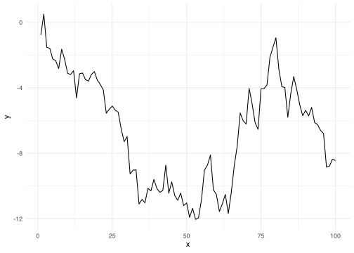

- [Citations](#citations)
  - [Attaching a supporting quote](#attaching-a-supporting-quote)
  - [Grouped citations with per-citation quotes](#grouped-citations-with-per-citation-quotes)
- [Callouts](#callouts)
- [Code](#code)
- [Math](#math)
- [Figures and cross-references](#figures-and-cross-references)
- [Tables](#tables)
- [Frontmatter options](#frontmatter-options)

This page is a reference for the formatting features available when writing pages on this site. Each section shows the source syntax you write and the result it produces, so you can copy a pattern directly. The examples below are live: the citations open the reference panel, the callouts are styled, and the figure is rendered from executed code.

## Citations

Citations are backed by a Zotero-managed bibliography. Every citation is clickable and opens a side panel showing the full reference, and optionally one or more supporting quotes.

The simplest form is a plain `@key`, which renders the author and year:

``` markdown
Large language models can stand in for survey respondents [@argyle2023].
```

Large language models can stand in for survey respondents <span class="cite-ref" data-cite-id="argyle2023" data-cite-ids="[&quot;argyle2023&quot;]" data-cite-quote="[]" data-cite-page="">(Argyle et al., 2023)</span>.

Several keys can be grouped in one set of brackets, separated by semicolons:

``` markdown
This idea has been examined from several angles [@argyle2023; @bisbee2024].
```

This idea has been examined from several angles <span class="cite-ref" data-cite-id="argyle2023" data-cite-ids="[&quot;argyle2023&quot;,&quot;bisbee2024&quot;]" data-cite-quote="[]" data-cite-page="">(Argyle et al., 2023; Bisbee et al., 2024)</span>.

### Attaching a supporting quote

To pull a quote from the source into the panel, use the `cite` shortcode. The first argument is the key; any string arguments after it are quotes:

``` markdown
!cite-shortcode!
```

The quote text shown in these examples is an illustrative placeholder, not a real excerpt. In practice you paste the actual passage. It renders as a normal citation: <span data-cite-id="argyle2023" data-cite-quote="[&quot;Supporting quote from the cited work goes here.&quot;]" data-cite-page="" class="cite-ref">(Argyle et al., 2023)</span>. Click it to see the quote and reference.

A bare integer as the last argument is treated as a page number, and multiple quote strings are shown as a list:

``` markdown
!cite-shortcode!
```

<span data-cite-id="brislin1970" data-cite-quote="[&quot;First supporting quote.&quot;,&quot;Second supporting quote.&quot;]" data-cite-page="185" class="cite-ref">(Brislin, 1970)</span>

### Grouped citations with per-citation quotes

When several citations share one parenthetical but each needs its own quote, use the `cites` shortcode. Each key is followed by an optional quote string; omit the string for keys that need no quote:

``` markdown
!cite-shortcode!
```

<span class="cite-ref" data-cite-id="argyle2023" data-cite-ids="[&quot;argyle2023&quot;,&quot;bisbee2024&quot;]" data-cite-quotes="{&quot;bisbee2024&quot;:&quot;Quote for the second source.&quot;,&quot;argyle2023&quot;:&quot;Quote for the first source.&quot;}" data-cite-quote="[]" data-cite-page="">(Argyle et al., 2023; Bisbee et al., 2024)</span>

Each author in the group is individually clickable, and the panel shows only that citation’s reference and quote. Use `cites` instead of the plain `[@a; @b]` form whenever any citation in the group needs a quote.

## Callouts

Callouts highlight a piece of text in a labelled box. They use the GitHub alert syntax: a blockquote whose first line is `[!TYPE]`. Five types are available.

``` markdown
> [!NOTE]
> Useful information the reader should notice.
```

> \[!NOTE\] Useful information the reader should notice.

> \[!TIP\] A helpful suggestion or shortcut.

> \[!IMPORTANT\] Something the reader must not miss.

> \[!WARNING\] A caution about a likely mistake.

> \[!CAUTION\] A risk with serious consequences.

## Code

Fenced code blocks are syntax-highlighted by language. A block tagged `r` is shown but not run, which is the right choice when you want to display code without executing it:

```` markdown
```r
model <- lm(y ~ x, data = data)
summary(model)
```
````

``` r
model <- lm(y ~ x, data = data)
summary(model)
```

On pages authored in Quarto, a chunk written with `{r}` instead is executed, and its output is embedded below the code:

``` r
x <- rnorm(100, mean = 50, sd = 10)
summary(x)
```

       Min. 1st Qu.  Median    Mean 3rd Qu.    Max. 
      34.23   44.13   50.97   51.09   56.49   74.52 

## Math

Mathematical notation is written in LaTeX and rendered with KaTeX. Inline math is wrapped in single dollar signs, so $\bar{x} = \frac{1}{n}\sum_{i=1}^{n} x_i$ sits in the flow of the text.

Display math is wrapped in double dollar signs and is set on its own line:

``` markdown
$$
s^2 = \frac{1}{n-1}\sum_{i=1}^{n}(x_i - \bar{x})^2
$$
```

$$
s^2 = \frac{1}{n-1}\sum_{i=1}^{n}(x_i - \bar{x})^2
$$

## Figures and cross-references

A figure produced by an executed chunk can be given a label and a caption. Quarto numbers the figure and lets you refer to it from the prose.

<details class="code-fold">
<summary>Code</summary>

``` r
library(tidyverse)

tibble(x = 1:100, y = cumsum(rnorm(100))) |>
  ggplot(aes(x, y)) +
  geom_line() +
  theme_minimal()
```

</details>

<div id="fig-demo">



Figure 1: A figure rendered from executed R code.

</div>

Referencing the chunk’s label with `@fig-demo` produces a numbered link: <a href="#fig-demo" class="quarto-xref">Figure 1</a> shows the result. Figure and table cross-references work this way; section cross-references (`@sec-`) are a known limitation and do not navigate.

## Tables

A data frame returned from an executed chunk is printed as a table:

``` r
tibble(
  measure = c("Mean", "SD", "Min", "Max"),
  value = c(mean(x), sd(x), min(x), max(x))
)
```

| measure |     value |
|:--------|----------:|
| Mean    | 51.089928 |
| SD      |  8.754406 |
| Min     | 34.229859 |
| Max     | 74.522933 |

Markdown tables written by hand are also supported:

``` markdown
| Column A | Column B |
| -------- | -------- |
| Cell 1   | Cell 2   |
```

| Column A | Column B |
|----------|----------|
| Cell 1   | Cell 2   |

## Frontmatter options

Each page begins with a YAML frontmatter block. The fields that affect rendering are:

``` yaml
---
title: "Page Title"
description: "One-line summary shown on the home page card."
toc: true # show the right-side table of contents
toc-depth: 2 # deepest heading level included in the TOC
order: 1 # position within its navigation group
---
```

<div id="refs" class="references csl-bib-body hanging-indent" entry-spacing="0" line-spacing="2">

<div id="ref-argyle2023" class="csl-entry">

Argyle, L. P., Busby, E. C., Fulda, N., Gubler, J. R., Rytting, C., & Wingate, D. (2023). Out of one, many: Using language models to simulate human samples. *Political Analysis*, *31*(3), 337–355. <https://doi.org/10.1017/pan.2023.2>

</div>

<div id="ref-bisbee2024" class="csl-entry">

Bisbee, J., Clinton, J., Dorff, C., Kenkel, B., & Larson, J. (2024). Synthetic replacements for human survey data? The perils of large language models. *Political Analysis*, *32*(3), 401–416. <https://doi.org/10.1017/pan.2023.27>

</div>

<div id="ref-brislin1970" class="csl-entry">

Brislin, R. W. (1970). Back-Translation for Cross-Cultural Research. *Journal of Cross-Cultural Psychology*, *1*(3), 185–216. <https://doi.org/10.1177/135910457000100301>

</div>

</div>
