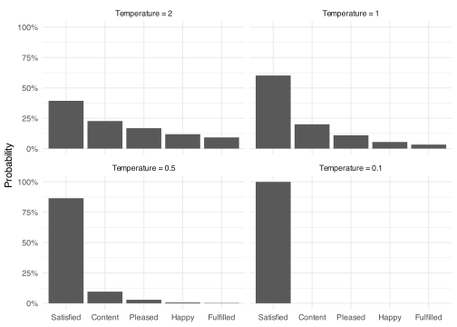

<details class="code-fold">
<summary>Code</summary>

``` r
library(tidyverse)
library(ellmer)

theme_set(theme_minimal())
```

</details>

Each token an LLM produces is the result of a random draw. The model assigns a probability to every token in its vocabulary, then samples a token from that distribution. The distribution is computed from the input and the model’s weights, and sampling from it means the same input can produce different output on different calls.

Let’s demo this using a local LLM model to translate the same Dutch survey text to English 25 times and count how often each translation appears.

``` r
results <- replicate(25, {
  chat <- chat_lmstudio(
    model = "google/gemma-4-26b-a4b-qat",
    system_prompt = "Translate the following Dutch survey text to English. Output only the translation, nothing else.",
    params = params(temperature = 1)
  )
  chat$chat(
    "Hieronder volgen een aantal uitspraken over hoe mensen zich kunnen voelen. Geef voor elke uitspraak aan in hoeverre deze op u van toepassing is."
  )
})

tibble(translation = results) |>
  count(translation, sort = TRUE)
```

| Translation | Count |
|:---|---:|
| Below are several statements about how people may feel. For each statement, indicate to what extent it applies to you. | 7 |
| Below are several statements about how people may feel. For each statement, please indicate to what extent it applies to you. | 5 |
| Below are a number of statements about how people may feel. For each statement, please indicate to what extent it applies to you. | 3 |
| Below are several statements about how people might feel. For each statement, please indicate to what extent it applies to you. | 2 |
| Below is a number of statements about how people may feel. For each statement, indicate to what extent it applies to you. | 2 |
| Below are a number of statements about how people might feel. For each statement, indicate to what extent it applies to you. | 1 |
| Below are a number of statements about how people might feel. For each statement, please indicate to what extent it applies to you. | 1 |
| Below are several statements about how people may feel. For each statement, indicate the extent to which it applies to you. | 1 |
| Below are several statements about how people may feel. For each statement, please indicate the extent to which it applies to you. | 1 |
| Below are several statements about how people might feel. For each statement, indicate to what extent it applies to you. | 1 |
| Below is a number of statements about how people may feel. For each statement, please indicate the extent to which it applies to you. | 1 |

With temperature at 1, the same item produces several different translations across calls. The rest of this page explains why, and how to suppress the variation when consistent output is needed.

## Temperature

The shape of that distribution is controlled by a parameter called temperature. At each step, the model assigns a numerical score to every token in its vocabulary, with higher scores indicating that a token is more likely to come next. Before converting these scores into probabilities, the model divides them by the temperature value (the raw scores are called logits). The conversion itself is done by a function called softmax, which exponentiates each divided score and rescales the results so they sum to one. A lower temperature sharpens the distribution: the highest-scoring token receives most of the probability mass and is selected nearly every time. A higher temperature flattens the distribution so that lower-scoring tokens receive relatively more probability and are selected more often.

As an example, suppose a model is translating “tevreden” from Dutch into English and has assigned raw scores to five candidate tokens. Applying softmax at different temperatures produces the following distributions.



At temperature 0.1, the distribution concentrates almost entirely on the top token, making output effectively deterministic. At temperature 2, probability is spread across all candidates and variation between calls is high. Temperature 1 leaves the distribution unchanged from what the model computes directly; most APIs default to 1. At the limit, temperature 0 skips sampling entirely. Dividing by zero is undefined, so this case is handled separately: rather than scaling the logits, the model selects the highest-scoring token directly at every step.

In ellmer, the temperature is set through the `params()` helper passed to the chat function. Applying this to our earlier example, setting it to 0 produces consistent translations.

## Reproducibility in practice

Setting temperature to 0 is therefore the right choice for any workflow where reproducibility matters, such as translating a questionnaire that may need to be re-run. For a given input, repeated calls will almost always produce identical output.

Exact reproducibility is not guaranteed, however. Floating-point operations on GPUs are not always deterministic, and the order of parallel computations can vary across different hardware, library versions, or batch sizes. In practice this rarely changes the output, but it can. Some APIs expose a `seed` parameter to further reduce this variability.

## Prompt design and consistency

Temperature is not the only factor that affects how much output varies across calls. The prompt itself also shapes consistency, independently of sampling.

This happens for two reasons. First, constraining the output format reduces the number of tokens where variation can accumulate. A prompt that asks for only the translated text produces fewer decisions than one that allows commentary or alternatives, and fewer decisions means less opportunity for different tokens to be sampled. Second, task framing affects how confident the model is at each step. Asking to “translate” implies a single correct rendering, which concentrates probability on the most familiar phrasing. Asking to “suggest a translation” or “rephrase in English” signals that multiple renderings are acceptable, which spreads probability more evenly.

The practical consequence is that both levers matter for reproducible workflows. Temperature 0 eliminates sampling randomness, but a loosely specified prompt leaves the model with high uncertainty at many token positions, and selecting the highest-scoring token at each of those positions can still produce different outputs when the model or infrastructure changes. A tightly specified prompt reduces that underlying uncertainty, making the output more stable regardless of temperature.

## Testing determinism in practice

The previous sections described two ways to push output toward determinism. Setting temperature to 0 removes the sampling step, so the highest-scoring token is selected at every position. A tightly specified prompt lowers the model’s uncertainty at those positions, leaving fewer places where a different token could plausibly be selected. Neither makes identical output certain, because selecting the highest-scoring token still depends on floating-point arithmetic that can vary across hardware and library versions. Knowing this does not tell us how often the output actually stays the same, so the only way to find out is to run the same input many times and count.

How much room there is for variation also depends on the text being translated. A single unambiguous word leaves almost no uncertainty: there is one plausible translation, and the model lands on it on every run. Longer items, and items where several English renderings are equally natural, create more token positions where a small difference in the floating-point arithmetic could tip the model toward a different choice. To cover both cases, the test below translates 20 Dutch survey texts 100 times each, recording the distinct translations each item produced across its runs. Every call uses the same model and the same bare prompt, with temperature set to 0 and no seed set.

The items span the range of text types that appear in a translated questionnaire. Response options include both single unambiguous words and options where two or more English renderings are equally natural. Question stems range from short factual questions to a long trust item with an embedded contrast. Scale instructions are longer sentences that explain how to use a response scale. Complex items are long sentences built around a disjunction, asking the respondent to choose between two described alternatives. The set also includes two items containing Dutch-specific institutional terms whose standard English rendering differs between British and American usage.

The following code carries out the test.

``` r
items <- tibble(
  type = c(
    rep("Response option", 10),
    rep("Question stem", 4),
    rep("Scale instruction", 2),
    rep("Complex item", 2),
    rep("Culturally specific", 2)
  ),
  dutch = c(
    "Ja",
    "Nee",
    "Nooit",
    "Altijd",
    "Weet niet",
    "Eens",
    "Helemaal mee eens",
    "Enigszins mee eens",
    "Soms",
    "Doorgaans",
    "Hoe oud bent u?",
    "Hoe geïnteresseerd bent u in politiek?",
    "Hoe tevreden bent u met uw leven als geheel?",
    "In het algemeen gesproken, vindt u dat de meeste mensen te vertrouwen zijn, of vindt u dat men niet voorzichtig genoeg kan zijn?",
    "Hieronder volgen een aantal uitspraken over hoe mensen zich kunnen voelen. Geef voor elke uitspraak aan in hoeverre deze op u van toepassing is.",
    "Kunt u uw mening geven op een schaal van 0 tot 10, waarbij 0 'helemaal niet tevreden' betekent en 10 'volledig tevreden'?",
    "Bent u, voor zover u weet, in het buitenland geboren, of zijn uw vader of moeder in het buitenland geboren?",
    "Als u zou kiezen tussen een baan die meer bevredigend maar slecht betaald is, en een baan die minder bevredigend maar goed betaald is, welke zou u dan kiezen?",
    "Heeft u in het afgelopen jaar contact gehad met een huisarts?",
    "Bent u lid van een vakbond?"
  )
)

consistency_results <- items |>
  mutate(
    translations = map(dutch, \(text) {
      replicate(100, {
        chat <- chat_lmstudio(
          model = "google/gemma-4-26b-a4b-qat",
          system_prompt = "Translate the following Dutch survey text to English. Output only the translation, nothing else.",
          params = params(temperature = 0)
        )
        chat$chat(text)
      })
    })
  ) |>
  unnest_longer(translations) |>
  count(type, dutch, translation = translations)
```

| Type | Source | Unique translations | Translation |
|:---|:---|---:|:---|
| Complex item | Als u zou kiezen tussen een baan die meer bevredigend maar slecht betaald is, en een baan die minder bevredigend maar goed betaald is, welke zou u dan kiezen? | 1 | If you had to choose between a job that is more satisfying but poorly paid, and a job that is less satisfying but well paid, which would you choose? |
| Complex item | Bent u, voor zover u weet, in het buitenland geboren, of zijn uw vader of moeder in het buitenland geboren? | 1 | To the best of your knowledge, were you born abroad, or were your father or mother born abroad? |
| Culturally specific | Bent u lid van een vakbond? | 1 | Are you a member of a trade union? |
| Culturally specific | Heeft u in het afgelopen jaar contact gehad met een huisarts? | 1 | Have you had contact with a general practitioner in the past year? |
| Question stem | Hoe geïnteresseerd bent u in politiek? | 1 | How interested are you in politics? |
| Question stem | Hoe oud bent u? | 1 | How old are you? |
| Question stem | Hoe tevreden bent u met uw leven als geheel? | 1 | How satisfied are you with your life as a whole? |
| Question stem | In het algemeen gesproken, vindt u dat de meeste mensen te vertrouwen zijn, of vindt u dat men niet voorzichtig genoeg kan zijn? | 1 | In general, do you think most people are trustworthy, or do you think one cannot be cautious enough? |
| Response option | Altijd | 1 | Always |
| Response option | Doorgaans | 1 | Generally |
| Response option | Eens | 1 | Agree |
| Response option | Enigszins mee eens | 1 | Somewhat agree |
| Response option | Helemaal mee eens | 1 | Completely agree |
| Response option | Ja | 1 | Yes |
| Response option | Nee | 1 | No |
| Response option | Nooit | 1 | Never |
| Response option | Soms | 1 | Sometimes |
| Response option | Weet niet | 1 | Don’t know |
| Scale instruction | Hieronder volgen een aantal uitspraken over hoe mensen zich kunnen voelen. Geef voor elke uitspraak aan in hoeverre deze op u van toepassing is. | 1 | Below are several statements about how people may feel. For each statement, please indicate to what extent it applies to you. |
| Scale instruction | Kunt u uw mening geven op een schaal van 0 tot 10, waarbij 0 ‘helemaal niet tevreden’ betekent en 10 ‘volledig tevreden’? | 1 | Could you please provide your opinion on a scale from 0 to 10, where 0 means ‘not at all satisfied’ and 10 means ‘completely satisfied’? |

Every item returned the same translation on all 100 runs, so each row shows a single string. Across all 20 items, spanning single words, long question stems, scale instructions, and items with embedded contrasts, fixing temperature at 0 produced complete consistency. The floating-point variation described above is possible in principle, but it did not surface here.
