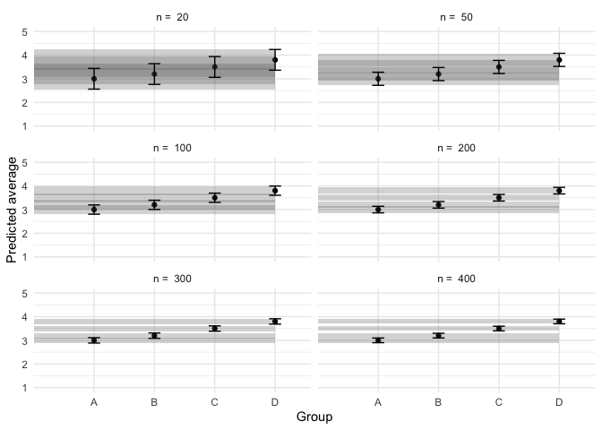

- [4 groups](#4-groups)

<details class="code-fold">
<summary>Code</summary>

``` r
library(MASS)
library(tidyverse)
library(lmerTest)
library(marginaleffects)

theme_set(theme_minimal())

set.seed(1)
```

</details>

## 4 groups

<details class="code-fold">
<summary>Code</summary>

``` r
# Set the simulation parameters
Ms <- c(3, 3.2, 3.5, 3.8)
SDs <- c(1, 1, 1, 1)
labels <- c("A", "B", "C", "D")

# Produce the variance-covariance matrix
Sigma <- matrix(
  nrow = length(Ms),
  ncol = length(Ms),
  data = diag(SDs)
)

preds <- tibble()
Ns <- c(20, 50, 100, 200, 300, 400)

# Simulate
for (n in Ns) {
  m <- mvrnorm(n = n, mu = Ms, Sigma = Sigma, empirical = TRUE)

  colnames(m) <- labels

  data <- m |>
    as_tibble() |>
    pivot_longer(
      cols = everything(),
      names_to = "predictor",
      values_to = "response"
    )

  mod <- lm(response ~ predictor, data = data)

  preds <- mod |>
    avg_predictions(variables = "predictor") |>
    as_tibble() |>
    mutate(n = n) |>
    bind_rows(preds)

  temp1 <- avg_comparisons(mod)
}

ggplot(preds, aes(x = predictor, y = estimate)) +
  geom_point(position = position_dodge(.9)) +
  geom_rect(
    aes(
      ymin = conf.low, ymax = conf.high,
      xmin = 0, xmax = 4,
      group = predictor
    ),
    alpha = .25
  ) +
  geom_errorbar(
    aes(ymin = conf.low, ymax = conf.high),
    width = .2, position = position_dodge(.9)
  ) +
  facet_wrap(
    ~n, 
    ncol = 2, 
    labeller = labeller(n = function(x) paste("n = ", x))
  ) +
  labs(
    x = "Group",
    y = "Predicted average"
  ) +
  scale_y_continuous(limits = c(1, 5), breaks = 1:5)
```

</details>


