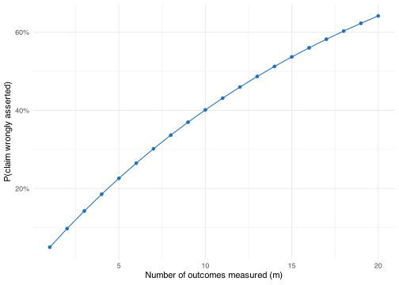
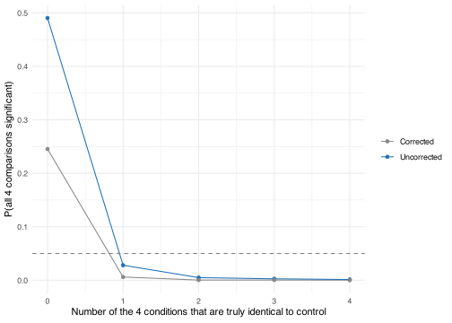

- [What family-wise error is](#what-family-wise-error-is)
- [Claim 1: The treatment affects at least one of multiple outcomes](#claim-1-the-treatment-affects-at-least-one-of-multiple-outcomes)
- [Claim 2: Does every condition beat the control?](#claim-2-does-every-condition-beat-the-control)
- [What counts as a “family”](#what-counts-as-a-family)
- [When to correct and when not to](#when-to-correct-and-when-not-to)

<details class="code-fold">
<summary>Code</summary>

``` r
library(tidyverse)

theme_set(theme_minimal())

color_primary <- "#2171b5"
color_secondary <- "#888888"
color_reference <- "gray50"
```

</details>

## What family-wise error is

A single hypothesis test run at α = .05 has a 5% chance of a false positive when the null hypothesis is true. That figure is the per-comparison error rate: the probability of a false positive on one test, considered on its own.

Running more than one test on the same data raises the probability that at least one of them turns up significant by chance alone, even though each test still runs at α = .05. The family-wise error rate is the probability of at least one false positive across a set, or family, of tests, all conducted under a true null.

Whether that probability is the right thing to worry about depends on the claim the tests are being used to support.

## Claim 1: The treatment affects at least one of multiple outcomes

A study compares a treatment group to a control group and records multiple outcome measures rather than one, because the researchers don’t know in advance which of them the treatment might move. The research claim is that the treatment affects at least one of these outcomes.

Suppose, for illustration, that this claim is false: the treatment affects none of the outcomes, so every one of the comparisons is testing a true null. The claim is wrongly supported whenever at least one of the comparisons is significant by chance. Tracking whether at least one of the first m comparisons is significant, for m = 1 through 20, traces out how often that mistake happens as more outcomes are added.

<details class="code-fold">
<summary>Code</summary>

``` r
alpha <- 0.05
k_max <- 20

fwer_any_effect <- tibble(
  m = 1:k_max,
  fwer = 1 - (1 - alpha)^m
)

ggplot(fwer_any_effect, aes(x = m, y = fwer)) +
  geom_line(color = color_primary) +
  geom_point(color = color_primary) +
  scale_y_continuous(labels = scales::percent_format()) +
  labs(x = "Number of outcomes measured (m)", y = "P(claim wrongly asserted)")
```

</details>



The false-claim rate is 1 - (1 - α)^m. With one outcome measured, it equals α, the per-comparison rate. With five outcomes it has already climbed past 20%; with twenty, past 60%.

The claim here is disjunctive: it is true if the treatment affects at least one outcome, so a false claim requires only one of the m comparisons to be a false positive. That is exactly the family-wise error rate, and it grows with the number of outcomes tested. A claim of this shape needs a correction procedure to keep the false-claim rate near the intended level.

## Claim 2: Does every condition beat the control?

A different study compares four treatment conditions against a single shared control and claims that every one of the four beats it — four redesigned versions of a product tested against the current baseline, say, with the claim being that all four improve on it. This claim is conjunctive rather than disjunctive: it is only true if every one of the four individual comparisons reflects a real difference, and asserting it means requiring all four p-values to be significant at once.

The simulation below varies how many of the four conditions are genuinely identical to control, from all four (a true null throughout) down to none (all four genuinely differ by the same amount), while the rest are drawn with a real effect. Each simulated dataset draws one control sample and reuses it for all four comparisons, matching a shared-control design. For each configuration the simulation tracks how often all four comparisons are significant at once, both without correction and under a Bonferroni correction that divides α by 4.

<details class="code-fold">
<summary>Code</summary>

``` r
set.seed(123)
n <- 40
k <- 4
d <- 0.6
alpha <- .05
n_sim <- 8000

sim_all_beat_control <- map_dfr(0:k, \(n_null) {
  effects <- c(rep(0, n_null), rep(d, k - n_null))

  reps <- map_dfr(seq_len(n_sim), \(i) {
    control <- rnorm(n, 0, 1)
    ps <- map_dbl(effects, \(delta) {
      treatment <- rnorm(n, delta, 1)
      t.test(treatment, control)$p.value
    })
    tibble(
      Uncorrected = all(ps < alpha),
      Corrected = all(ps < alpha / k)
    )
  })

  tibble(
    n_null = n_null,
    Uncorrected = mean(reps$Uncorrected),
    Corrected = mean(reps$Corrected)
  )
})

sim_all_beat_control
```

</details>

| n_null | Uncorrected | Corrected |
|-------:|------------:|----------:|
|      0 |    0.490375 |  0.245375 |
|      1 |    0.028000 |  0.006000 |
|      2 |    0.004875 |  0.000250 |
|      3 |    0.002625 |  0.000375 |
|      4 |    0.001250 |  0.000125 |

``` r
sim_all_beat_control_long <- sim_all_beat_control |>
  pivot_longer(
    c(Uncorrected, Corrected),
    names_to = "method",
    values_to = "rate"
  )

ggplot(sim_all_beat_control_long, aes(x = n_null, y = rate, color = method)) +
  geom_line() +
  geom_point() +
  geom_hline(yintercept = alpha, linetype = "dashed", color = color_reference) +
  scale_color_manual(
    values = c("Uncorrected" = color_primary, "Corrected" = color_secondary)
  ) +
  labs(
    x = "Number of the 4 conditions that are truly identical to control",
    y = "P(all 4 comparisons significant)",
    color = NULL
  )
```



The right-hand side of the plot is where the claim is false: at least one of the four conditions doesn’t really differ from control, so asserting “all four beat control” would be a mistake. Making that mistake needs the one (or more) truly null comparisons to come up significant by chance at the same time as the genuinely different conditions come up significant on their own merits. Requiring more from the compound event only makes it less likely, not more, so the uncorrected false-claim rate stays at or below α across every one of these configurations without any correction at all.

The left-hand side, at zero truly null conditions, is where the claim is true: all four conditions really do differ from control. There, the value on the y-axis is the power to correctly assert the claim, not an error rate, and this is where the two methods pull apart. The uncorrected procedure has substantially more power to detect the true conjunction than the Bonferroni-corrected one, because the correction demands a stricter threshold on all four comparisons even though the false-claim rate was already controlled without it.

A claim that only holds when every one of several comparisons holds is called an intersection-union test. Using each comparison at the uncorrected level α already keeps the overall false-claim rate at or below α, regardless of how many comparisons are involved or how correlated they are with each other. Correcting for multiplicity here trades power for protection the claim never needed.

## What counts as a “family”

The formula from the first scenario needs one input to do its work: m, the number of tests in the family. Deciding what belongs in that family is a judgment call, not something the data can settle.

A family is usually understood as the set of tests that address one research question or one claim. The 20 outcome comparisons in the first scenario are a natural family, since a reader would treat “the treatment did something” as one claim regardless of which specific outcome carries it. A comparison reported in an unrelated part of the same paper, addressing a different question with different data, is ordinarily a separate family: correcting across it would control an error rate that has no shared claim behind it.

The boundary gets harder to draw with secondary or exploratory comparisons. A study with one pre-registered primary outcome and ten additional outcomes examined without a specific prior hypothesis raises the question of whether the primary test stands alone or belongs to a family of eleven. Two researchers can look at the same set of analyses and disagree about how many families it contains, because the answer depends on what claim each analysis is being used to support, not on any property of the data itself.

## When to correct and when not to

A single planned comparison, specified before the data were seen and used to answer one question, is a family of one. The formula from the first scenario gives a family-wise error rate equal to α in that case, so there is nothing for a correction to do.

Beyond that, whether a family needs correction depends on the shape of the claim, not just the number of comparisons in it. A disjunctive claim — true if any one comparison shows an effect, as in the first scenario — is put at risk by a single false positive, and the false-claim rate climbs with the number of comparisons exactly as the family-wise error rate does. A conjunctive claim — true only if every comparison shows an effect, as in the second scenario — is protected by its own structure: making the compound claim requires every comparison to come out significant, and that requirement can only lower the chance of a false claim, never raise it. Correction only makes sense for the first kind.

Even where correction is warranted, it is a trade, not a free improvement: holding the family-wise error rate at α means using a stricter threshold for each individual test, which lowers the power to detect a real effect on any one of them. Whether that trade is worth making depends on the cost of a false positive relative to the cost of missing a true effect in the context at hand. A confirmatory result that will inform a costly downstream decision usually calls for tighter control; an early, exploratory scan intended to generate candidates for later, better-powered follow-up can tolerate a higher family-wise error rate in exchange for more power to notice something worth pursuing.

The [omnibus F-test](../omnibus-test/) page works through this trade-off concretely for the case of pairwise comparisons following an ANOVA, comparing an uncorrected procedure against Holm and Tukey correction under a partial null.
