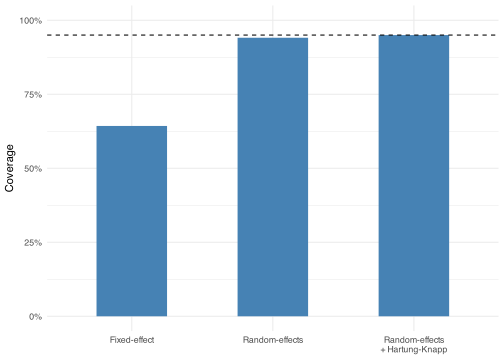

- [A set of studies](#a-set-of-studies)
- [Pooling by precision](#pooling-by-precision)
- [When studies disagree](#when-studies-disagree)
- [The random-effects estimate](#the-random-effects-estimate)
- [Does it matter?](#does-it-matter)
- [The average versus a new study](#the-average-versus-a-new-study)

``` r
library(tidyverse)
library(metafor)

theme_set(theme_minimal())

set.seed(3)
```

Meta-analysis combines the results of several studies into a single estimate of an effect. Each study reports an effect size and a measure of how uncertain that estimate is, and meta-analysis pools them, weighting more precise studies more heavily, into an estimate sharper than any study on its own. This page builds that machinery up by hand and checks each piece against `metafor`, the standard R package for meta-analysis, so the formulas and the software agree at every step.

## A set of studies

To watch the machinery work, we simulate studies from a known true effect, so every result can be checked against the truth. Each of 20 studies estimates the same effect of 0.5. Larger studies estimate it more precisely, so their sampling variance (`vi`) is smaller; the observed effect size (`yi`) is the true effect plus sampling error.

``` r
mu <- 0.5
k <- 20

dat <- tibble(
  study = seq_len(k),
  n = sample(40:400, k, replace = TRUE),
  vi = 4 / n,
  yi = rnorm(k, mu, sqrt(vi))
)

head(dat) |>
  knitr::kable(digits = 3)
```

| study |   n |    vi |    yi |
|------:|----:|------:|------:|
|     1 | 300 | 0.013 | 0.425 |
|     2 | 225 | 0.018 | 0.663 |
|     3 | 179 | 0.022 | 0.530 |
|     4 |  75 | 0.053 | 0.366 |
|     5 | 225 | 0.018 | 0.374 |
|     6 | 315 | 0.013 | 0.477 |

The effect sizes scatter around the true value of 0.5, some above, some below, and the smaller-variance studies are the ones to trust more.

## Pooling by precision

A plain average of the effect sizes treats a tiny study and a large one as equals.

``` r
mean(dat$yi)
```

    [1] 0.5251863

Meta-analysis instead weights each study by its precision, the inverse of its sampling variance, so informative studies count for more. The pooled estimate is the weighted mean, and its standard error follows from the total weight.

``` r
w <- 1 / dat$vi

pooled <- sum(w * dat$yi) / sum(w)
se <- sqrt(1 / sum(w))

c(estimate = pooled, se = se)
```

      estimate         se 
    0.50527886 0.03129588 

The payoff of pooling is precision: the standard error of the combined estimate is smaller than that of even the single most precise study.

``` r
c(pooled = se, best_single_study = sqrt(min(dat$vi)))
```

               pooled best_single_study 
           0.03129588        0.10411584 

This is the **fixed-effect model**, and `rma()` with `method = "FE"` fits it directly.

``` r
fit_fe <- rma(yi, vi, data = dat, method = "FE")
fit_fe
```


    Fixed-Effects Model (k = 20)

    I^2 (total heterogeneity / total variability):   0.00%
    H^2 (total variability / sampling variability):  0.81

    Test for Heterogeneity:
    Q(df = 19) = 15.3458, p-val = 0.7004

    Model Results:

    estimate      se     zval    pval   ci.lb   ci.ub      
      0.5053  0.0313  16.1452  <.0001  0.4439  0.5666  *** 

    ---
    Signif. codes:  0 '***' 0.001 '**' 0.01 '*' 0.05 '.' 0.1 ' ' 1

The estimate and standard error reported by `rma()` match the values we computed by hand. The model recovers the true effect of 0.5 with a tight interval, doing it more precisely than any individual study.

## When studies disagree

The fixed-effect model assumes every study estimates the *same* true effect. Real studies differ in their populations, methods, and measures, so their true effects vary. We simulate that by drawing each study’s true effect from a distribution centered on `mu` with between-study variance `tau2_true`, then adding sampling error as before.

``` r
tau2_true <- 0.05

dat_het <- dat |>
  mutate(
    theta = rnorm(k, mu, sqrt(tau2_true)),
    yi = rnorm(k, theta, sqrt(vi))
  )
```

Three quantities summarize how much the studies disagree. Cochran’s `Q` is the weighted spread of the effect sizes around the pooled estimate; `tau2` is the estimated between-study variance, in the squared units of the effect size; and `I2` is the percentage of the total variation that is due to real heterogeneity rather than sampling error. Each can be written down by hand. `tau2` here uses the DerSimonian-Laird estimator, the classic closed-form one.

``` r
w <- 1 / dat_het$vi
fe_mean <- sum(w * dat_het$yi) / sum(w)

Q <- sum(w * (dat_het$yi - fe_mean)^2)
C <- sum(w) - sum(w^2) / sum(w)
tau2 <- max(0, (Q - (k - 1)) / C)
typical_v <- (k - 1) * sum(w) / (sum(w)^2 - sum(w^2))
I2 <- 100 * tau2 / (tau2 + typical_v)

c(Q = Q, tau2 = tau2, I2 = I2)
```

              Q        tau2          I2 
    66.25248444  0.04920927 71.32183018 

Fitting a random-effects model with `method = "DL"` reproduces all three exactly.

``` r
fit_dl <- rma(yi, vi, data = dat_het, method = "DL")
fit_dl
```


    Random-Effects Model (k = 20; tau^2 estimator: DL)

    tau^2 (estimated amount of total heterogeneity): 0.0492 (SE = 0.0234)
    tau (square root of estimated tau^2 value):      0.2218
    I^2 (total heterogeneity / total variability):   71.32%
    H^2 (total variability / sampling variability):  3.49

    Test for Heterogeneity:
    Q(df = 19) = 66.2525, p-val < .0001

    Model Results:

    estimate      se    zval    pval   ci.lb   ci.ub      
      0.4917  0.0601  8.1752  <.0001  0.3738  0.6096  *** 

    ---
    Signif. codes:  0 '***' 0.001 '**' 0.01 '*' 0.05 '.' 0.1 ' ' 1

The `tau^2`, `I^2`, and `Q` in the output are the hand-computed values. The fixed-effect model, fit to the same data, ignores this extra variation, so the confidence interval it reports is too narrow for data that genuinely disagree.

``` r
rma(yi, vi, data = dat_het, method = "FE")
```


    Fixed-Effects Model (k = 20)

    I^2 (total heterogeneity / total variability):   71.32%
    H^2 (total variability / sampling variability):  3.49

    Test for Heterogeneity:
    Q(df = 19) = 66.2525, p-val < .0001

    Model Results:

    estimate      se     zval    pval   ci.lb   ci.ub      
      0.4874  0.0313  15.5738  <.0001  0.4261  0.5487  *** 

    ---
    Signif. codes:  0 '***' 0.001 '**' 0.01 '*' 0.05 '.' 0.1 ' ' 1

## The random-effects estimate

The random-effects model accounts for the disagreement by widening each study’s variance by `tau2` before weighting. The weights become `1 / (vi + tau2)`, which pulls the studies closer together: once every study carries an irreducible chunk of between-study variance, the precise studies no longer dominate as heavily.

``` r
ws <- 1 / (dat_het$vi + tau2)

re_pooled <- sum(ws * dat_het$yi) / sum(ws)
re_se <- sqrt(1 / sum(ws))

c(estimate = re_pooled, se = re_se)
```

     estimate        se 
    0.4917240 0.0601485 

These match the estimate and standard error from `fit_dl` above. The pooled estimate barely moves, but the standard error is larger, and the confidence interval wider, honestly reflecting that the studies disagree.

`metafor`’s default estimator is REML, not DerSimonian-Laird, so `rma(yi, vi)` with no `method` argument gives a slightly different `tau2`. It is the better default for real use; we used DL only because it has a closed form to check by hand.

``` r
rma(yi, vi, data = dat_het)
```


    Random-Effects Model (k = 20; tau^2 estimator: REML)

    tau^2 (estimated amount of total heterogeneity): 0.0493 (SE = 0.0232)
    tau (square root of estimated tau^2 value):      0.2220
    I^2 (total heterogeneity / total variability):   71.36%
    H^2 (total variability / sampling variability):  3.49

    Test for Heterogeneity:
    Q(df = 19) = 66.2525, p-val < .0001

    Model Results:

    estimate      se    zval    pval   ci.lb   ci.ub      
      0.4917  0.0602  8.1696  <.0001  0.3738  0.6097  *** 

    ---
    Signif. codes:  0 '***' 0.001 '**' 0.01 '*' 0.05 '.' 0.1 ' ' 1

## Does it matter?

A wider interval is only better if it is the *right* width. That is testable: across many simulated heterogeneous datasets, a calibrated 95% confidence interval should contain the true mean of 0.5 about 95% of the time. The check below fits a fixed-effect model, a random-effects model, and a random-effects model with `metafor`’s Hartung-Knapp small-sample adjustment (`test = "knha"`) to 1,000 datasets each.

``` r
simulate_once <- function() {
  d <- tibble(n = sample(40:400, k, replace = TRUE), vi = 4 / n) |>
    mutate(
      theta = rnorm(k, mu, sqrt(tau2_true)),
      yi = rnorm(k, theta, sqrt(vi))
    )

  fit_fe <- rma(yi, vi, data = d, method = "FE")
  fit_re <- rma(yi, vi, data = d)
  fit_knha <- rma(yi, vi, data = d, test = "knha")

  tibble(
    fixed = mu > fit_fe$ci.lb & mu < fit_fe$ci.ub,
    random = mu > fit_re$ci.lb & mu < fit_re$ci.ub,
    random_knha = mu > fit_knha$ci.lb & mu < fit_knha$ci.ub
  )
}

set.seed(42)
coverage <- map(seq_len(1000), \(i) simulate_once()) |> list_rbind()
```

``` r
coverage |>
  summarise(across(everything(), mean)) |>
  pivot_longer(everything(), names_to = "model", values_to = "coverage") |>
  mutate(
    model = factor(
      model,
      levels = c("fixed", "random", "random_knha"),
      labels = c("Fixed-effect", "Random-effects", "Random-effects\n+ Hartung-Knapp")
    )
  ) |>
  ggplot(aes(x = model, y = coverage)) +
  geom_col(fill = "steelblue", width = 0.5) +
  geom_hline(yintercept = 0.95, linetype = "dashed") +
  scale_y_continuous(limits = c(0, 1), labels = scales::percent) +
  labs(x = NULL, y = "Coverage")
```



The fixed-effect interval falls well short of 95%: it assumes one true effect, so under heterogeneity it is badly overconfident. The random-effects interval is far better. It still dips a little below 95% because, with only 20 studies, `tau2` is estimated imprecisely and the standard interval doesn’t account for that; the Hartung-Knapp adjustment corrects for it and reaches the nominal rate.

## The average versus a new study

The random-effects estimate is the *average* true effect across studies. It says nothing about how widely effects vary, that is the job of the prediction interval, which describes the range a new study’s true effect might plausibly fall in. The two answer different questions, and a large `I2` can sit alongside a precise average.

This page assumed each study contributes one independent effect size. When studies contribute several effect sizes that are not independent, from multiple outcomes or a shared control group, see [Dependent Effect Sizes](../dependent-effect-sizes/); when the within-study and between-study variation are themselves of interest, see [Multilevel Meta-Analysis](../multilevel/).
