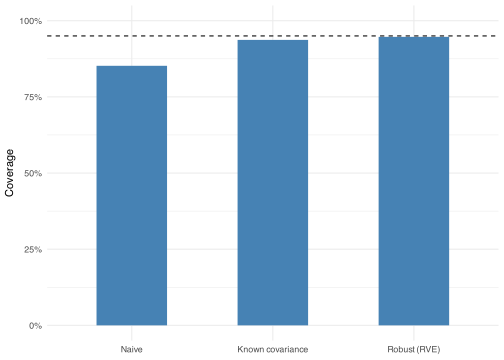
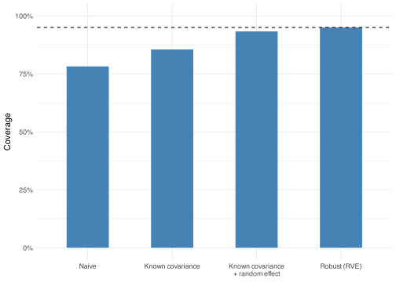

- [Handling the covariance](#handling-the-covariance)
- [Case study: Shared control groups](#case-study-shared-control-groups)
  - [Adding between-study heterogeneity](#adding-between-study-heterogeneity)

<details class="code-fold">
<summary>Code</summary>

``` r
library(tidyverse)
library(metafor)
library(knitr)

# Styling
theme_set(theme_minimal())

# Custom functions
simulate_study <- function(study) {
  control <- rnorm(n_control, mean = 0, sd = sigma)
  treatments <- map(
    seq_len(n_arms),
    \(a) rnorm(n_treatment, mean = delta * sigma, sd = sigma)
  )

  tibble(
    study = study,
    treatment = LETTERS[seq_len(n_arms)],
    m1i = map_dbl(treatments, mean),
    sd1i = map_dbl(treatments, sd),
    n1i = n_treatment,
    m2i = mean(control),
    sd2i = sd(control),
    n2i = n_control
  )
}

simulate_shared_data <- function() {
  map(seq_len(n_studies), simulate_study) |>
    list_rbind()
}

# Seed
set.seed(42)
```

</details>

Meta-analysis combines effect sizes from multiple sources to estimate an overall effect. Conventionally, each study contributes one effect size and studies are treated as independent observations. That assumption breaks when a single study contributes multiple effect sizes, whether from different outcomes, time points, or subgroups sharing a common control group. Those effect sizes are not independent draws from the population of studies, and treating them as if they were leads to incorrect inferences.

Dependence affects the output of a meta-analytic model unevenly. It leaves the point estimate of the overall effect largely intact but distorts the uncertainty around it, often shrinking it. Effect sizes from the same study overlap in the information they carry, so together they provide less independent information than their number suggests. Treating them as independent ignores that overlap and credits each effect more than it should, making the evidence look stronger than it is. The standard error comes out too small and the confidence interval too narrow.

## Handling the covariance

The independence assumption can be seen in the variance-covariance matrix. Standard meta-analysis uses only the sampling variance of each effect size, the diagonal of this matrix. The off-diagonal terms are the covariances between pairs of effect sizes, and assuming independence sets them all to zero. Dependence is exactly the case where they are not zero, so correcting for it is a matter of dealing with those off-diagonal terms. There are four ways to do that:

- **Compute them.** In certain cases you can use the study design to determine what the covariances are. They can be calculated directly from the data and handed to the model.
- **Assume them.** Alternatively, you can assume the covariances based on conservative assumptions or empirical data about likely covariances.
- **Estimate them.** A model with a study-level random effect makes every effect size within a study share a common component, which induces a covariance between them. Fitting the model estimates that covariance.
- **Bypass them.** Robust variance estimation never specifies the off-diagonal terms at all. It estimates the standard error empirically from how much whole studies vary, leaving the covariance structure unmodeled. That makes it robust for the overall mean but silent on how much the effect truly varies across studies, so it fits when the mean is all you need.

The starting question is whether the covariance can be computed from the design. When it can, that is the option to take: it relies on no assumptions and stays valid even with few studies. When it cannot, the fallback is to assume, estimate, or bypass the covariance, and which of those is best depends on other things, including whether the variance components are of interest, how many studies there are, and how much you are willing to assume.

## Case study: Shared control groups

A common design compares several treatments against a single shared control group. With four treatments and one control group, a study yields four effect sizes. Because all four are computed against the same control group, they are not independent: a shared input feeds every one. That covariance is determined entirely by the group sizes, which means in this case the covariances can be computed, without estimation or assumptions.

We can illustrate this using simulation. Below we simulate 30 studies, each with four treatment groups of 50 participants and a shared control group of 100, and a true standardized mean difference of 0.5 for every treatment. The control group is larger because it is reused across all four comparisons, which is the efficient way to size a shared-control design. Every study shares that same true effect, so there is no between-study heterogeneity, leaving the shared control as the only source of dependence.

``` r
n_studies <- 30
delta <- 0.5 # true standardized mean difference
sigma <- 1 # common within-group SD
n_arms <- 4
n_control <- 100
n_treatment <- 50
```

Rather than start from effect sizes, the simulation generates participant scores for each group and reduces them to the mean, standard deviation, and sample size a paper would report. The control group is drawn once per study and reused for all four treatment contrasts, which is what links the effect sizes. Each study contributes four effect sizes, one per treatment condition.

``` r
data_shared <- simulate_shared_data()
head(data_shared, 8) |>
  kable()
```

| study | treatment |       m1i |      sd1i | n1i |       m2i |      sd2i | n2i |
|------:|:----------|----------:|----------:|----:|----------:|----------:|----:|
|     1 | A         | 0.3487489 | 0.9275740 |  50 | 0.0325148 | 1.0413570 | 100 |
|     1 | B         | 0.4762837 | 0.8849022 |  50 | 0.0325148 | 1.0413570 | 100 |
|     1 | C         | 0.5079399 | 0.9882337 |  50 | 0.0325148 | 1.0413570 | 100 |
|     1 | D         | 0.4713238 | 1.0547258 |  50 | 0.0325148 | 1.0413570 | 100 |
|     2 | A         | 0.3805789 | 0.9961675 |  50 | 0.0329365 | 0.8761978 | 100 |
|     2 | B         | 0.3837601 | 1.0533961 |  50 | 0.0329365 | 0.8761978 | 100 |
|     2 | C         | 0.6454133 | 1.1136332 |  50 | 0.0329365 | 0.8761978 | 100 |
|     2 | D         | 0.3593137 | 1.0012037 |  50 | 0.0329365 | 0.8761978 | 100 |

The treatment columns (`m1i`, `sd1i`, `n1i`) differ between treatment conditions, but the control columns (`m2i`, `sd2i`, `n2i`) are identical within a study.

`escalc()` converts the group summaries into effect sizes. With `measure = "SMD"` it returns Hedges’ g and its sampling variance as `yi` and `vi`.

``` r
data_shared <- escalc(
  measure = "SMD",
  m1i = m1i,
  sd1i = sd1i,
  n1i = n1i,
  m2i = m2i,
  sd2i = sd2i,
  n2i = n2i,
  data = data_shared
)

data_shared |>
  head(8) |>
  kable()
```

| study | treatment | m1i | sd1i | n1i | m2i | sd2i | n2i | yi | vi |
|---:|:---|---:|---:|---:|---:|---:|---:|---:|---:|
| 1 | A | 0.3487489 | 0.9275740 | 50 | 0.0325148 | 1.0413570 | 100 | 0.3130279 | 0.0303266 |
| 1 | B | 0.4762837 | 0.8849022 | 50 | 0.0325148 | 1.0413570 | 100 | 0.4449447 | 0.0306599 |
| 1 | C | 0.5079399 | 0.9882337 | 50 | 0.0325148 | 1.0413570 | 100 | 0.4618915 | 0.0307111 |
| 1 | D | 0.4713238 | 1.0547258 | 50 | 0.0325148 | 1.0413570 | 100 | 0.4174603 | 0.0305809 |
| 2 | A | 0.3805789 | 0.9961675 | 50 | 0.0329365 | 0.8761978 | 100 | 0.3769138 | 0.0304735 |
| 2 | B | 0.3837601 | 1.0533961 | 50 | 0.0329365 | 0.8761978 | 100 | 0.3718848 | 0.0304610 |
| 2 | C | 0.6454133 | 1.1136332 | 50 | 0.0329365 | 0.8761978 | 100 | 0.6338830 | 0.0313394 |
| 2 | D | 0.3593137 | 1.0012037 | 50 | 0.0329365 | 0.8761978 | 100 | 0.3531605 | 0.0304157 |

All four effect sizes in a study are standardized against the same control mean and SD, so a control sample that happens to sit high pulls every treatment-versus-control difference down together. That shared control is the covariance among the effect sizes, the off-diagonal terms a naive analysis sets to zero.

A standard meta-analysis uses only `vi`, ignoring that covariance.

``` r
fit_naive_shared <- rma(yi, vi, data = data_shared)
fit_naive_shared
```


    Random-Effects Model (k = 120; tau^2 estimator: REML)

    tau^2 (estimated amount of total heterogeneity): 0.0069 (SE = 0.0049)
    tau (square root of estimated tau^2 value):      0.0833
    I^2 (total heterogeneity / total variability):   18.37%
    H^2 (total variability / sampling variability):  1.23

    Test for Heterogeneity:
    Q(df = 119) = 147.0723, p-val = 0.0413

    Model Results:

    estimate      se     zval    pval   ci.lb   ci.ub      
      0.4551  0.0177  25.6564  <.0001  0.4203  0.4898  *** 

    ---
    Signif. codes:  0 '***' 0.001 '**' 0.01 '*' 0.05 '.' 0.1 ' ' 1

With 30 studies of four effect sizes each, the model treats all 120 as independent, so the confidence interval it reports is narrower than the data support.

The compute strategy fills in the missing covariances. A covariance is a correlation times the two standard errors, and the variances are already in `vi`, so for each off-diagonal term the only thing missing is the correlation between the pair. For a shared control, that correlation is fixed by the group sizes, reflecting how much of each effect size’s sampling variance comes from the common control. It works out to `n_treatment / (n_treatment + n_control)`, about 0.33.

To turn that into the full variance-covariance matrix `V`, we use `vcalc()`. It needs to know which groups each effect size compares, and the data has no such labels yet, so we add them first: a distinct id for each treatment and a single shared id for the control, the same across all of a study’s rows. `vcalc()` reads the treatment id as `grp1` and the control id as `grp2`, recognizes that the rows in a study share the control, and combines that with the group sizes passed as `w1` and `w2`. Without them `vcalc()` would assume equally large groups and a correlation of 0.5, too high here since the treatments (50) are smaller than the control (100). Finally, `rma.mv()` takes `V` in place of `vi`.

``` r
data_shared <- mutate(
  data_shared,
  id_treatment = match(treatment, LETTERS) + 1L,
  id_control = 1L
)

V <- vcalc(
  vi,
  cluster = study,
  grp1 = id_treatment,
  grp2 = id_control,
  w1 = n1i,
  w2 = n2i,
  data = data_shared
)

fit_corr_shared <- rma.mv(yi, V, data = data_shared)
```

Computing the covariance is not the only option to address the dependence. We can also bypass the problem using, **robust variance estimation (RVE)**. Instead of deriving the standard error from an assumed variance structure, it estimates it empirically from the residuals, clustered by study, so the variance of the mean effect comes from how much whole studies vary. This gives the right standard error regardless of the within-study covariance, without ever specifying it. The limitation is that it needs enough studies to be stable, becoming imprecise below roughly 20. It is applied by passing the fitted model to `robust()` with a cluster variable.

``` r
fit_rve_shared <- robust(fit_naive_shared, cluster = data_shared$study)
```

In the table below we compare the three different models.

<details class="code-fold">
<summary>Code</summary>

``` r
model_summary <- function(fit) {
  tibble(
    Estimate = fit$beta[[1]],
    SE = fit$se,
    `CI lower` = fit$ci.lb,
    `CI upper` = fit$ci.ub
  )
}

bind_rows(
  Naive = model_summary(fit_naive_shared),
  `Known covariance` = model_summary(fit_corr_shared),
  RVE = model_summary(fit_rve_shared),
  .id = "Model"
) |>
  knitr::kable(digits = 3)
```

</details>

| Model            | Estimate |    SE | CI lower | CI upper |
|:-----------------|---------:|------:|---------:|---------:|
| Naive            |    0.455 | 0.018 |    0.420 |    0.490 |
| Known covariance |    0.453 | 0.023 |    0.408 |    0.497 |
| RVE              |    0.455 | 0.027 |    0.400 |    0.510 |

The point estimates are similar, but the naive model reports a narrower confidence interval than either correction.

A narrower interval is not automatically the wrong one, though. The naive model might be right and the corrections overcautious, or the naive model might be overconfident. The table above cannot settle it, because it comes from a single dataset: each interval either contains the true effect or not, and one hit or miss says little about how often the model’s intervals contain the truth in the long run.

That long-run rate is coverage: across many datasets, the fraction of a model’s intervals that contain the true value. A valid 95% confidence interval should capture the truth 95% of the time. An interval that is too narrow, claiming more precision than the data support, captures it less often than that; one that is too wide captures it more. Coverage is therefore the test of whether a model’s stated uncertainty is honest. Because the data are simulated, we know the true effect is 0.5 and can measure coverage directly: the check below generates 1,000 datasets, fits all three models to each, and records how often each model’s 95% interval contains 0.5.

``` r
simulate_once_shared <- function() {
  dat <- escalc(
    measure = "SMD",
    m1i = m1i,
    sd1i = sd1i,
    n1i = n1i,
    m2i = m2i,
    sd2i = sd2i,
    n2i = n2i,
    data = simulate_shared_data()
  ) |>
    mutate(
      grp_treatment = match(treatment, LETTERS) + 1L,
      grp_control = 1L
    )

  V <- vcalc(
    vi,
    cluster = study,
    grp1 = grp_treatment,
    grp2 = grp_control,
    w1 = n1i,
    w2 = n2i,
    data = dat
  )

  fit_naive <- rma(yi, vi, data = dat)
  fit_corr <- rma.mv(yi, V, data = dat)
  fit_rve <- robust(fit_naive, cluster = dat$study)

  tibble(
    naive = delta > fit_naive$ci.lb & delta < fit_naive$ci.ub,
    corrected = delta > fit_corr$ci.lb & delta < fit_corr$ci.ub,
    rve = delta > fit_rve$ci.lb & delta < fit_rve$ci.ub
  )
}

results_shared <- map(seq_len(1000), \(i) simulate_once_shared()) |>
  list_rbind()
```

``` r
results_shared |>
  summarise(across(everything(), mean)) |>
  pivot_longer(everything(), names_to = "model", values_to = "coverage") |>
  mutate(
    model = factor(
      model,
      levels = c("naive", "corrected", "rve"),
      labels = c("Naive", "Known covariance", "Robust (RVE)")
    )
  ) |>
  ggplot(aes(x = model, y = coverage)) +
  geom_col(fill = "steelblue", width = 0.5) +
  geom_hline(yintercept = 0.95, linetype = "dashed") +
  scale_y_continuous(limits = c(0, 1), labels = scales::percent) +
  labs(x = NULL, y = "Coverage")
```



The naive model falls short of 95%, while both corrections are well calibrated. Computing the covariance is the better choice here: it uses the covariance implied by the group sizes rather than estimating the standard error empirically, so it is more efficient and stays valid even with few studies. RVE earns its place whenever the dependence structure is uncertain or hard to specify fully, as the next section shows.

### Adding between-study heterogeneity

So far every study has shared the same true effect of 0.5, which kept the shared control as the only source of dependence. Real studies differ in their populations, interventions, and measures, so their true effects vary. That variation, between-study heterogeneity, adds a second kind of dependence within each study: the four effects now share not only a control group but a common true effect. The question is whether the known-covariance model and RVE still cover correctly once both are present.

The simulation gains one step. Each study draws its own true effect from a normal distribution centered on 0.5, and its arms are generated around that study-specific value. The spread of those true effects is set by `tau2_between`.

``` r
tau2_between <- 0.01 # variance of true effects across studies
```

``` r
simulate_hetero_study <- function(study) {
  study_effect <- rnorm(1, delta, sqrt(tau2_between))
  control <- rnorm(n_control, mean = 0, sd = sigma)
  treatments <- map(
    seq_len(n_arms),
    \(a) rnorm(n_treatment, mean = study_effect * sigma, sd = sigma)
  )

  tibble(
    study = study,
    treatment = LETTERS[seq_len(n_arms)],
    m1i = map_dbl(treatments, mean),
    sd1i = map_dbl(treatments, sd),
    n1i = n_treatment,
    m2i = mean(control),
    sd2i = sd(control),
    n2i = n_control
  )
}

simulate_hetero_data <- function() {
  map(seq_len(n_studies), simulate_hetero_study) |>
    list_rbind()
}
```

Only the mean passed to the treatment groups has changed, from the fixed `delta` to a study-specific `study_effect`; the rest matches the earlier simulation.

The coverage check now fits four models to 1,000 datasets: the naive model, the known-covariance model, the known-covariance model with a study-level random effect added, and RVE.

``` r
simulate_once_hetero <- function() {
  dat <- escalc(
    measure = "SMD",
    m1i = m1i,
    sd1i = sd1i,
    n1i = n1i,
    m2i = m2i,
    sd2i = sd2i,
    n2i = n2i,
    data = simulate_hetero_data()
  ) |>
    mutate(
      grp_treatment = match(treatment, LETTERS) + 1L,
      grp_control = 1L
    )

  V <- vcalc(
    vi,
    cluster = study,
    grp1 = grp_treatment,
    grp2 = grp_control,
    w1 = n1i,
    w2 = n2i,
    data = dat
  )

  fit_naive <- rma(yi, vi, data = dat)
  fit_corr <- rma.mv(yi, V, data = dat)
  fit_re <- rma.mv(yi, vi, random = ~ 1 | study, data = dat)
  fit_corr_re <- rma.mv(yi, V, random = ~ 1 | study, data = dat)
  fit_rve <- robust(fit_naive, cluster = dat$study)

  tibble(
    naive = delta > fit_naive$ci.lb & delta < fit_naive$ci.ub,
    corrected = delta > fit_corr$ci.lb & delta < fit_corr$ci.ub,
    corrected_re = delta > fit_corr_re$ci.lb & delta < fit_corr_re$ci.ub,
    rve = delta > fit_rve$ci.lb & delta < fit_rve$ci.ub,
    re = delta > fit_re$ci.lb & delta < fit_re$ci.ub,
    tau2_re = fit_re$sigma2[1],
    tau2_corr_re = fit_corr_re$sigma2[1]
  )
}

results_hetero <- map(seq_len(1000), \(i) simulate_once_hetero()) |>
  list_rbind()
```

``` r
results_hetero |>
  select(naive, corrected, corrected_re, rve) |>
  summarise(across(everything(), mean)) |>
  pivot_longer(everything(), names_to = "model", values_to = "coverage") |>
  mutate(
    model = factor(
      model,
      levels = c("naive", "corrected", "corrected_re", "rve"),
      labels = c(
        "Naive",
        "Known covariance",
        "Known covariance\n+ random effect",
        "Robust (RVE)"
      )
    )
  ) |>
  ggplot(aes(x = model, y = coverage)) +
  geom_col(fill = "steelblue", width = 0.5) +
  geom_hline(yintercept = 0.95, linetype = "dashed") +
  scale_y_continuous(limits = c(0, 1), labels = scales::percent) +
  labs(x = NULL, y = "Coverage")
```



The naive and known-covariance models both fall short, but not equally. Modeling the shared control through `V` lifts coverage well above the naive model. It still misses 95%, though, because `V` represents only the covariance the shared control creates. The shared true effect is a different kind of dependence, one a fixed-effects model has no term for, so the uncertainty in the mean stays understated. Computing the covariance solves part of the problem, not all of it.

Adding a study-level random effect closes the rest of the gap. `rma.mv(yi, V, random = ~ 1 | study)` models both sources at once: `V` for the shared control, the random effect for the heterogeneity. This is the compute and estimate strategies working together, and its coverage returns to near 95%. RVE needs no such adjustment. It was already calibrated, because clustering by study is agnostic to why the arms within a study covary; it absorbs the shared control and the heterogeneity together without modeling either.

Coverage of the mean is only one question, though. A meta-analysis usually also asks how much the effect varies between studies, the heterogeneity (`τ²`) that drives the prediction interval for a new study. There the models that agreed on the mean come apart. The table compares what a random effect alone and the same model with `V` estimate for `τ²`, against the true value of 0.01.

``` r
tibble(
  Model = c("Random effect only", "V + random effect"),
  `Mean coverage` = c(mean(results_hetero$re), mean(results_hetero$corrected_re)),
  `Estimated τ²` = c(mean(results_hetero$tau2_re), mean(results_hetero$tau2_corr_re))
) |>
  knitr::kable(digits = 3)
```

| Model              | Mean coverage | Estimated τ² |
|:-------------------|--------------:|-------------:|
| Random effect only |         0.935 |        0.018 |
| V + random effect  |         0.933 |        0.010 |

Both cover the mean equally well, yet their heterogeneity estimates split apart. Without `V`, the model has no term for the shared control, so it folds that sampling covariance into apparent between-study variation and overstates `τ²`; with `V`, it recovers the truth. RVE offers no fix here: it robustifies the mean’s standard error and leaves the variance components exactly as the model estimated them.

So what you need depends on what you are estimating. For the overall effect, a random effect or RVE is enough, and the dependence never has to be modeled exactly. For the between-study variance, and the prediction interval built on it, you need `V` to separate genuine heterogeneity from the shared-control noise.
