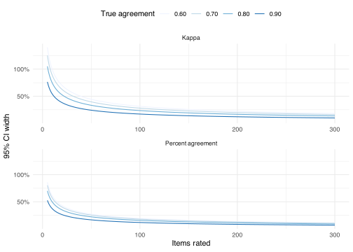

- [mall](#mall)
  - [Setup](#setup)
  - [Data](#data)
  - [Classification](#classification)
- [Evaluating LLM performance](#evaluating-llm-performance)
  - [Against ground truth](#against-ground-truth)
  - [Interactive human evaluation](#interactive-human-evaluation)
  - [Sample size planning](#sample-size-planning)

``` r
library(tidyverse)
library(mall)
library(cli)
```

LLMs can assign text to predefined categories reliably and at scale, without manually labelling every item. This is useful for open-ended survey responses, product reviews, social media posts, or any text where you want to sort items into groups. However, despite their abilities, it remains necessary to validate their output and see whether they correctly categorized the responses, or at least match the performance of human raters.

This page uses the `mall` package to classify movie reviews and then shows two ways to evaluate how well the LLM performs.

## mall

The `mall` package provides a tidy interface for common LLM tasks, including classification. It works by sending each row of a dataframe column to an LLM and returning the result in a new column. The LLM can be a local model or a commercial model available via APIs. In the example below we use a local Gemma 4 model.

### Setup

Specify the backend once with `llm_use()`:

``` r
llm_use("ollama", "gemma4:e4b")
```

### Data

The `movie_review` dataset from the `text2vec` package contains 5,000 IMDB movie reviews with known sentiment labels (positive or negative). We work with a random sample of 50 reviews with fewer than 250 characters, to keep this simple.

``` r
set.seed(44)
data(movie_review, package = "text2vec")

reviews <- movie_review |>
  as_tibble() |>
  mutate(
    sentiment = if_else(sentiment == 1, "positive", "negative"),
    review = str_remove_all(review, "<[^>]+>") |> str_squish()
  ) |>
  filter(nchar(review) < 250) |>
  slice_sample(n = 50)

reviews
```

    # A tibble: 50 × 3
       id       sentiment review                                                    
       <chr>    <chr>     <chr>                                                     
     1 1433_10  positive  "Brilliant execution in displaying once and for all, this…
     2 10403_2  negative  "Just a few words.... This movie really sucks. It's like …
     3 8716_10  positive  "I thought this was a quiet good movie. It was fun to wat…
     4 12193_10 positive  "What can I say, it's a damn good movie. See it if you st…
     5 259_3    negative  "photography was too jumpy to follow. dark scenes hard to…
     6 1550_1   negative  "I honestly don't understand how tripe like this gets mad…
     7 11950_2  negative  "This is without a doubt the worst movie I have ever seen…
     8 8713_10  positive  "This movie is full of references. Like \\\"Mad Max II\\\…
     9 12058_4  negative  "Repugnant Bronson thriller. Unfortunately, it's technica…
    10 5060_8   positive  "The movie is wonderful. It shows the man's work for the …
    # ℹ 40 more rows

### Classification

`llm_classify()` takes a dataframe, the column containing the text, and a character vector of valid categories. It sends each review to the LLM and appends the result in a new `.classify` column:

``` r
mall_results <- reviews |>
  llm_classify(review, c("positive", "negative"))
```

Since each review requires a separate LLM call, classification can take a while. To log progress during a longer run, process one row at a time inside `map()` with purrr’s built-in progress bar:

``` r
mall_results <- map(
  seq_len(nrow(reviews)),
  \(i) reviews[i, ] |> llm_classify(review, c("positive", "negative")),
  .progress = "Classifying reviews"
) |>
  bind_rows()
```

``` r
saveRDS(mall_results, "mall_results.rds")
```

    # A tibble: 50 × 4
       id      sentiment review                                            .classify
       <chr>   <chr>     <chr>                                             <chr>    
     1 1433_10 positive  "Brilliant execution in displaying once and for … negative 
     2 9599_1  negative  "Boring, badly written Italian exploitation flic… negative 
     3 825_1   negative  "I can't believe they got the actors and actress… positive 
     4 5060_8  positive  "The movie is wonderful. It shows the man's work… positive 
     5 1550_1  negative  "I honestly don't understand how tripe like this… negative 
     6 11950_2 negative  "This is without a doubt the worst movie I have … negative 
     7 8713_10 positive  "<br /><br />This movie is full of references. L… positive 
     8 12058_4 negative  "Repugnant Bronson thriller. Unfortunately, it's… negative 
     9 235_10  positive  "A wonderful movie! Anyone growing up in an Ital… positive 
    10 4518_9  positive  "Adrian Pasdar is excellent is this film. He mak… positive 
    # ℹ 40 more rows

## Evaluating LLM performance

### Against ground truth

Because `movie_review` includes known sentiment labels, we can measure LLM performance directly rather than relying on human spot-checks. We compute accuracy and Cohen’s kappa against the true labels:

``` r
library(psych)
```


    Attaching package: 'psych'

    The following objects are masked from 'package:ggplot2':

        %+%, alpha

``` r
results <- mall_results |>
  mutate(correct = sentiment == .classify)

n <- nrow(results)
agree <- sum(results$correct)

wilson <- prop.test(agree, n, correct = FALSE)

cat(sprintf(
  "Accuracy: %d/%d (%.0f%%) [95%% CI: %.0f%%–%.0f%%]\n",
  agree,
  n,
  wilson$estimate * 100,
  wilson$conf.int[1] * 100,
  wilson$conf.int[2] * 100
))
```

    Accuracy: 46/50 (92%) [95% CI: 81%–97%]

``` r
kappa_result <- cohen.kappa(data.frame(
  true = results$sentiment,
  llm = results$.classify
))

cat(sprintf(
  "Kappa:    %.2f [95%% CI: %.2f–%.2f]\n",
  kappa_result$kappa,
  kappa_result$confid["unweighted kappa", "lower"],
  kappa_result$confid["unweighted kappa", "upper"]
))
```

    Kappa:    0.84 [95% CI: 0.69–0.99]

**Accuracy** is the proportion of items the LLM labelled correctly. The Wilson 95% CI tells you the plausible range of true accuracy given the sample size — with 50 reviews the CI will be wide (roughly ±14 percentage points), so a larger sample gives a more precise estimate. **Cohen’s kappa** adjusts for the chance that the LLM would pick the right label at random; for a balanced binary task like this, chance agreement is 50%, so kappa and accuracy will be closely related. Both metrics come with confidence intervals so you can judge whether you have enough data to determine agreement.

### Interactive human evaluation

When ground truth labels are not available, the alternative is to label a random sample yourself and measure agreement between your labels and the LLM’s. The chunk below runs an interactive session in your R console: each iteration shows a random review, asks for your label, then reveals the LLM’s label and updates the running agreement statistics.

``` r
llm_labels_all <- mall_results$.classify
reviews_text <- mall_results$review
categories <- c("positive", "negative")

human_labels <- character(0)
llm_labels <- character(0)
seen <- integer(0)

repeat {
  remaining <- setdiff(seq_along(reviews_text), seen)
  if (length(remaining) == 0) {
    cli_alert_success("All reviews labelled.")
    break
  }

  i <- sample(remaining, 1)
  seen <- c(seen, i)

  cli_rule(left = paste("Review", length(seen), "of", length(reviews_text)))
  cat("\n", reviews_text[i], "\n\n")
  input <- tolower(trimws(readline(
    prompt = paste0("Label (", paste(categories, collapse = "/"), "/q): ")
  )))

  if (input == "q") {
    break
  }
  if (!input %in% categories) {
    cli_alert_warning("Unrecognised label — skipping.")
    seen <- seen[-length(seen)]
    next
  }

  human_labels <- c(human_labels, input)
  llm_labels <- c(llm_labels, llm_labels_all[i])

  n <- length(human_labels)
  agree <- sum(human_labels == llm_labels)

  wilson <- prop.test(agree, n, correct = FALSE)
  pct <- wilson$estimate
  ci <- wilson$conf.int

  cli_rule(left = "Results")
  cli_text("You: {.strong {input}}  |  LLM: {.strong {llm_labels_all[i]}}")
  cat("\n")
  cli_text(
    "Agreement: {agree}/{n} ({round(pct * 100)}%)",
    " [95% CI: {round(ci[1] * 100)}%–{round(ci[2] * 100)}%]"
  )

  if (n >= 2) {
    ratings <- data.frame(human = human_labels, llm = llm_labels)
    kappa_result <- tryCatch(cohen.kappa(ratings), error = function(e) NULL)
    if (!is.null(kappa_result)) {
      k <- kappa_result$kappa
      k_ci <- kappa_result$confid["unweighted kappa", c("lower", "upper")]
      cli_text(
        "Kappa:     {round(k, 2)}",
        " [95% CI: {round(k_ci['lower'], 2)}–{round(k_ci['upper'], 2)}]"
      )
    }
  }
  cat("\n")
}
```

The CI on percent agreement narrows as you label more items. Once the lower bound exceeds whatever threshold you find acceptable — say, 80% — you have statistical evidence the LLM is performing well enough.

### Sample size planning

Before you start labelling, it helps to know how many items you need to reach a CI narrow enough to be informative. The answer depends on two things: the CI width you can tolerate and the true agreement you expect. Both metrics have closed-form approximations.

For **percent agreement**, the 95% CI width is:

$$w \approx 2 \times 1.96 \times \sqrt{\frac{p(1-p)}{n}}$$

Solving for $n$:

$$n \approx \frac{4 \times 1.96^2 \times p(1-p)}{w^2}$$

For **kappa**, the Cicchetti approximation gives a similar expression. It assumes balanced categories (equal base rates for each class), under which chance agreement is $p_e = 0.5$ and observed agreement maps to kappa as $p_0 = (\kappa + 1)/2$:

$$n \approx \frac{16 \times 1.96^2 \times p_0(1-p_0)}{w^2}$$

The factor of 16 rather than 4 reflects that kappa compresses the scale by $(1 - p_e) = 0.5$, requiring roughly four times as many observations for the same CI width.

``` r
required_n <- function(
  width,
  agreement,
  conf = 0.95,
  metric = c("percent", "kappa")
) {
  metric <- match.arg(metric)
  z <- qnorm(1 - (1 - conf) / 2)
  if (metric == "percent") {
    ceiling(4 * z^2 * agreement * (1 - agreement) / width^2)
  } else {
    p0 <- (agreement + 1) / 2
    ceiling(16 * z^2 * p0 * (1 - p0) / width^2)
  }
}
```

For example, to achieve a CI no wider than ±10 percentage points (total width 0.20), assuming 80% true agreement:

``` r
required_n(width = 0.20, agreement = 0.80, metric = "percent")
```

    [1] 62

``` r
required_n(width = 0.20, agreement = 0.80, metric = "kappa")
```

    [1] 139

The plot below shows how CI width shrinks with sample size for a range of assumed agreement levels. Kappa consistently requires more items than percent agreement to achieve the same precision.


