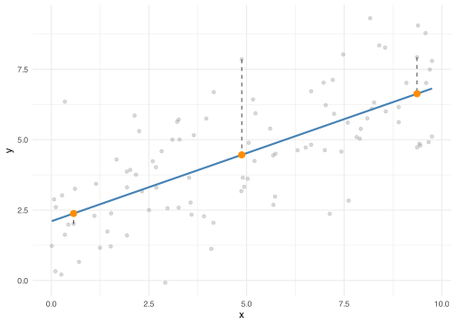
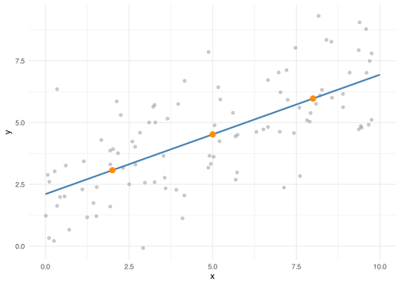
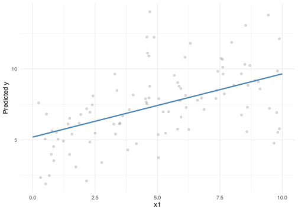
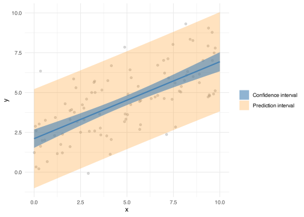

- [What predict() actually does](#what-predict-actually-does)
- [Multiple predictors](#multiple-predictors)
- [Confidence intervals vs. prediction intervals](#confidence-intervals-vs-prediction-intervals)

<details class="code-fold">
<summary>Code</summary>

``` r
library(tidyverse)

theme_set(theme_minimal())
```

</details>

After fitting a regression model, it can be used to predict the outcome for specific predictor values. Those values could describe a hypothetical respondent with, for example, a chosen age and income. It could be a long sequence of predictor values spanning the data’s range, used to trace how the model’s prediction changes across that range while every other predictor stays fixed, something the raw data can’t show directly once more than one predictor is in the model. Or it could be one meaningful reference value, like the sample mean, used to report what the model predicts at that point directly, rather than leaving the reader to work it out from the model’s coefficients.

In R, prediction is done with `predict()`. On this page, we cover how this function works to illustrate the mechanics of prediction.

## What predict() actually does

We simulate a dataset where `y` depends on `x` plus some random noise, and fit a linear regression to it.

<details open class="code-fold">
<summary>Code</summary>

``` r
set.seed(926)

n <- 100
x <- runif(n, min = 0, max = 10)
y <- 2 + 0.5 * x + rnorm(n, sd = 1.5)

data <- tibble(x = x, y = y)

model <- lm(y ~ x, data = data)
```

</details>

Fitting `y ~ x` gives the model an intercept and a slope, together defining a straight line through the data. For every row in `data`, the fitted value for `y` is that line’s equation evaluated at the row’s `x`: the intercept plus the slope times `x`, the point on the line directly above it. `fitted()` returns these values.

<details open class="code-fold">
<summary>Code</summary>

``` r
fitted(model) |> head()
```

</details>

           1        2        3        4        5        6 
    6.098641 2.844276 4.534957 6.498500 2.237724 4.631067 

The plot below shows the full dataset in grey and the fitted line in blue. Three example points are picked out and connected by a dashed segment to their fitted value, in orange, showing where each one sits on the line at the same `x`.

<details open class="code-fold">
<summary>Code</summary>

``` r
example <- data |>
  mutate(fitted = fitted(model)) |>
  arrange(x) |>
  slice(10, 50, 90)

ggplot() +
  geom_point(data = data, aes(x, y), color = "grey50", alpha = 0.3) +
  geom_smooth(
    data = data,
    aes(x, y),
    method = "lm",
    se = FALSE,
    color = "steelblue"
  ) +
  geom_segment(
    data = example,
    aes(x = x, y = y, xend = x, yend = fitted),
    linetype = "dashed",
    color = "grey30"
  ) +
  geom_point(data = example, aes(x, fitted), color = "darkorange", size = 3)
```

</details>

    `geom_smooth()` using formula = 'y ~ x'

<div id="fig-fitted-values">



Figure 1: The data (grey) and fitted line (blue), with three example points connected by dashed segments to their fitted values (orange), the points on the fitted line at the same x.

</div>

Calling `predict()` on the model without giving it anything else returns the same values.

<details open class="code-fold">
<summary>Code</summary>

``` r
predict(model) |> head()
```

</details>

           1        2        3        4        5        6 
    6.098641 2.844276 4.534957 6.498500 2.237724 4.631067 

`fitted()` and `predict()` agree here because they’re doing the same thing: reading off the fitted line at each `x` in the training data. What makes `predict()` more useful is that it isn’t limited to those rows. Given a data frame of new `x` values, called `newdata`, `predict()` applies the same rule, the fitted line, to produce a guess for each one, whether or not the original data contained a point anywhere near it.

<details open class="code-fold">
<summary>Code</summary>

``` r
new_data <- tibble(x = c(2, 5, 8))

predict(model, newdata = new_data)
```

</details>

           1        2        3 
    3.071292 4.520490 5.969688 

Each of these three numbers is where the fitted line sits above `x = 2`, `x = 5`, and `x = 8`. The plot below shows why: the grey points are the training data, the blue line is the fitted line running through them, and the orange points are the three predictions, sitting exactly on the line at the `x` values we asked for, regardless of whether any training data was actually near them.

<details open class="code-fold">
<summary>Code</summary>

``` r
line_data <- tibble(x = seq(0, 10, length.out = 100))
line_data$y <- predict(model, newdata = line_data)

new_preds <- new_data
new_preds$y <- predict(model, newdata = new_data)

ggplot() +
  geom_point(data = data, aes(x, y), color = "grey50", alpha = 0.4) +
  geom_line(data = line_data, aes(x, y), color = "steelblue", linewidth = 1) +
  geom_point(data = new_preds, aes(x, y), color = "darkorange", size = 3)
```

</details>

<div id="fig-predict-line">



Figure 2: The fitted line and the three predictions from new_data, which sit exactly on it.

</div>

## Multiple predictors

A model can have more than one predictor, and `predict()` handles that the same way: it just needs a value for every predictor the model was fit on. We simulate a dataset where `y` depends on two predictors, `x1` and `x2`, and fit a model with both.

<details open class="code-fold">
<summary>Code</summary>

``` r
set.seed(158)

x1 <- runif(n, min = 0, max = 10)
x2 <- runif(n, min = 0, max = 5)

data2 <- tibble(
  x1 = x1,
  x2 = x2,
  y = 2 + 0.5 * x1 + 1.2 * x2 + rnorm(n, sd = 1.5)
)

model2 <- lm(y ~ x1 + x2, data = data2)
```

</details>

The fitted line becomes a fitted plane: the predicted `y` is the intercept plus the coefficient on `x1` times `x1`, plus the coefficient on `x2` times `x2`. `newdata` has to supply a value for both, one column per predictor, or `predict()` has nothing to plug into the equation.

<details open class="code-fold">
<summary>Code</summary>

``` r
new_data2 <- tibble(x1 = c(2, 5, 8), x2 = c(1, 2, 3))

predict(model2, newdata = new_data2)
```

</details>

           1        2        3 
    4.779326 7.115200 9.451074 

Leaving out one of the predictors doesn’t make `predict()` fall back to some default for it. It has no value to plug into the equation, so it refuses outright.

<details open class="code-fold">
<summary>Code</summary>

``` r
predict(model2, newdata = tibble(x1 = c(2, 5, 8)))
```

</details>

    Warning: 'newdata' had 3 rows but variables found have 100 rows

    Error in `model.frame.default()`:
    ! variable lengths differ (found for 'x2')

Because the prediction depends on both `x1` and `x2`, a plot of predicted `y` against `x1` alone needs `x2` fixed at some value, otherwise there’s no single line to draw. Holding `x2` at its mean and predicting across a range of `x1` traces how the prediction changes with `x1` while `x2` stays constant.

<details open class="code-fold">
<summary>Code</summary>

``` r
x1_seq <- tibble(x1 = seq(0, 10, length.out = 100), x2 = mean(data2$x2))
x1_seq$y <- predict(model2, newdata = x1_seq)

ggplot() +
  geom_point(data = data2, aes(x1, y), color = "grey50", alpha = 0.3) +
  geom_line(data = x1_seq, aes(x1, y), color = "steelblue", linewidth = 1) +
  labs(y = "Predicted y")
```

</details>

<div id="fig-predict-multiple">



Figure 3: Predicted y across a range of x1, with x2 held fixed at its mean.

</div>

The grey points scatter more widely around this line than the points did in the single-predictor plots earlier, because each one also differs in `x2`, whose effect isn’t shown here. The line isolates `x1`’s relationship with `y` by holding `x2` fixed; the points still carry `x2`’s variation.

Holding `x2` at its mean was one choice among several for a predictor that isn’t being varied: a continuous predictor is often fixed at its mean or median, a categorical one at its reference level, or any of them at whatever value is most relevant to the question. Whichever value is chosen changes the prediction, not just the plot’s cosmetics.

<details open class="code-fold">
<summary>Code</summary>

``` r
new_data3 <- tibble(x1 = 5, x2 = c(min(data2$x2), mean(data2$x2), max(data2$x2)))

predict(model2, newdata = new_data3)
```

</details>

            1         2         3 
     5.133167  7.420748 10.049041 

The three predictions above differ only because `x2` was fixed at a different value each time; `x1` was 5 throughout. Fixing every predictor at its own mean is a common default, but with correlated predictors it doesn’t necessarily describe a real observation: no row in the data may actually combine both means, and the prediction describes a combination the model never saw.

An alternative is to not fix `x2` at all: predict at every value `x2` takes in the data and average the results, instead of picking one stand-in value. That’s the marginal, or adjusted, mean, and it’s worked through in [Controlling for Covariates](../adjusted-means/).

## Confidence intervals vs. prediction intervals

Every prediction so far has been a single number, the model’s best guess, but that guess comes with uncertainty. `predict()` can report two different kinds of interval around it, and they answer two different questions.

One question is how sure we are about where the line itself sits. The line was estimated from a limited sample, so a different sample of the same size would have produced a slightly different line, a bit higher, lower, steeper, or shallower. That uncertainty about the line’s position is what `interval = "confidence"` captures.

<details open class="code-fold">
<summary>Code</summary>

``` r
predict(model, newdata = new_data, interval = "confidence")
```

</details>

           fit      lwr      upr
    1 3.071292 2.651279 3.491304
    2 4.520490 4.214304 4.826676
    3 5.969688 5.530727 6.408649

A different question is how sure we are about where one new, individual observation will fall. This is a harder question, because even a perfectly known line doesn’t pass through every point. Individual observations scatter above and below the line, and that scatter doesn’t shrink no matter how much data is collected. Predicting a single new observation means accounting for both sources of uncertainty at once: not knowing exactly where the line is, and the fact that a real observation won’t land exactly on it anyway. That’s `interval = "prediction"`.

<details open class="code-fold">
<summary>Code</summary>

``` r
predict(model, newdata = new_data, interval = "prediction")
```

</details>

           fit         lwr      upr
    1 3.071292 -0.01628947 6.158873
    2 4.520490  1.44632354 7.594656
    3 5.969688  2.87947166 9.059903

The prediction interval carries both sources of uncertainty; the confidence interval carries only one. It’s always at least as wide, and usually much wider, which shows clearly when the two are drawn on the same plot.

<details open class="code-fold">
<summary>Code</summary>

``` r
x_seq <- tibble(x = seq(0, 10, length.out = 100))

ci_band <- predict(model, newdata = x_seq, interval = "confidence") |>
  as_tibble() |>
  bind_cols(x_seq)

pi_band <- predict(model, newdata = x_seq, interval = "prediction") |>
  as_tibble() |>
  bind_cols(x_seq)

ggplot() +
  geom_point(data = data, aes(x, y), color = "grey50", alpha = 0.3) +
  geom_ribbon(
    data = pi_band,
    aes(x, ymin = lwr, ymax = upr, fill = "Prediction interval"),
    alpha = 0.25
  ) +
  geom_ribbon(
    data = ci_band,
    aes(x, ymin = lwr, ymax = upr, fill = "Confidence interval"),
    alpha = 0.6
  ) +
  geom_line(data = ci_band, aes(x, fit), color = "steelblue", linewidth = 1) +
  scale_fill_manual(
    name = NULL,
    values = c(
      "Confidence interval" = "steelblue",
      "Prediction interval" = "darkorange"
    )
  ) +
  labs(y = "y")
```

</details>

<div id="fig-ci-pi">



Figure 4: The confidence interval (narrow, blue) and prediction interval (wide, orange) around the fitted line.

</div>

This particular calculation assumes the scatter around the line is roughly the same size everywhere along it, an assumption `lm()` makes but not every model does.
