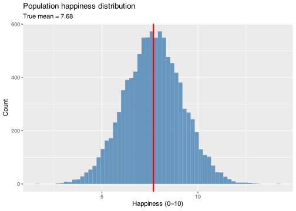
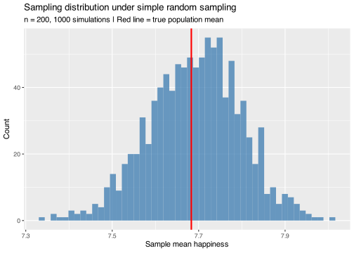
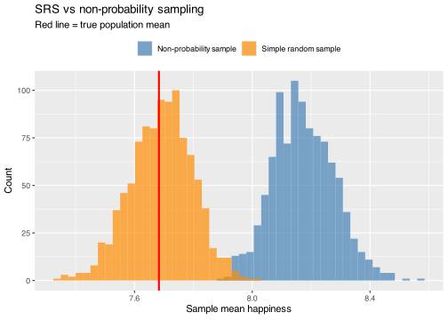
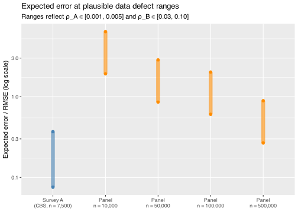

``` r
library(tidyverse)

set.seed(42)
```

## The population

We start with a synthetic population of 10,000 people whose self-reported happiness follows a roughly normal distribution. We set the true mean to **7.7**, matching the 2025 figure reported by Statistics Netherlands.

``` r
N <- 10000

population <- tibble(
  id        = 1:N,
  happiness = rnorm(N, mean = 7.7, sd = 1.5)
)

pop_mean <- mean(population$happiness)

ggplot(population, aes(x = happiness)) +
  geom_histogram(bins = 60, fill = "steelblue", alpha = 0.8) +
  geom_vline(xintercept = pop_mean, color = "red", linewidth = 1) +
  labs(
    title = "Population happiness distribution",
    subtitle = paste0("True mean = ", round(pop_mean, 2)),
    x = "Happiness (0–10)", y = "Count"
  )
```



The red line marks the true population mean — the quantity we want to estimate from a sample.

## Simple random sampling is unbiased

With **simple random sampling (SRS)**, every person has an equal probability of being selected. To see what this means in practice, we draw 1,000 independent samples of size $n = 200$ and record the sample mean each time.

``` r
n    <- 200
sims <- 1000

estimates_srs <- replicate(sims, {
  population |> slice_sample(n = n) |> pull(happiness) |> mean()
})

tibble(estimate = estimates_srs) |>
  ggplot(aes(x = estimate)) +
  geom_histogram(bins = 50, fill = "steelblue", alpha = 0.8) +
  geom_vline(xintercept = pop_mean, color = "red", linewidth = 1) +
  labs(
    title = "Sampling distribution under simple random sampling",
    subtitle = paste0("n = ", n, ", ", sims, " simulations | Red line = true population mean"),
    x = "Sample mean happiness", y = "Count"
  )
```



The distribution of estimates is **centred on the true mean**. Individual samples vary — some overestimate, some underestimate — but there is no systematic bias. This is the defining property of probability sampling.

## Non-probability sampling introduces bias

Now suppose we can’t draw a random sample. Instead, people self-select into our dataset. Happier people are more inclined to share their feelings; unhappier people tend to opt out.

We parameterise the selection mechanism directly in terms of something interpretable: the mean happiness difference between people who self-select in and those who don’t. Setting `delta_selection = 0.5` means that participants are on average **0.5 happiness points happier** than the general population — a moderate but realistic self-selection effect.

``` r
delta_selection <- 0.5  # participants are this many points happier on average

population <- population |>
  mutate(
    # Exponential tilt: k = delta/var(Y) gives the desired mean difference in expectation
    p_select = exp(delta_selection / var(happiness) * happiness)
  )
```

In concrete terms, this selection mechanism means three equivalent things:

- **Mean difference**: participants are on average 0.5 happiness points happier than non-participants
- **Relative likelihood**: each additional happiness point makes someone 25% more likely to self-select — so someone scoring 8 is 1.6× as likely to end up in the dataset as someone scoring 6
- **Data defect correlation**: $\rho_{R,Y}$ = 0.047 — a number we will return to shortly

``` r
estimates_nonprob <- replicate(sims, {
  population |>
    slice_sample(n = n, weight_by = p_select) |>
    pull(happiness) |>
    mean()
})

bind_rows(
  tibble(estimate = estimates_srs,     method = "Simple random sample"),
  tibble(estimate = estimates_nonprob, method = "Non-probability sample")
) |>
  ggplot(aes(x = estimate, fill = method)) +
  geom_histogram(bins = 50, alpha = 0.7, position = "identity") +
  geom_vline(xintercept = pop_mean, color = "red", linewidth = 1) +
  scale_fill_manual(values = c("steelblue", "darkorange")) +
  labs(
    title = "SRS vs non-probability sampling",
    subtitle = "Red line = true population mean",
    x = "Sample mean happiness", y = "Count", fill = NULL
  ) +
  theme(legend.position = "top")
```



The non-probability sample consistently **overestimates** happiness: people who report higher happiness are more likely to participate, so the sample is no longer a mirror of the population. Crucially, a larger non-probability sample doesn’t fix this — it just gives you a more precise estimate of the wrong number.

This is the core problem that Meng’s (2018) **data defect index** quantifies.

## The data defect index

Meng (2018) shows that the expected error of a sample mean decomposes into three factors:

$$\bar{Y}_n - \bar{Y}_N = \underbrace{\rho_{R,Y}}_{\text{data quality}} \times \underbrace{\sqrt{\frac{N - n}{n}}}_{\text{data quantity}} \times \underbrace{\sigma_Y}_{\text{problem difficulty}}$$

where $\rho_{R,Y}$ is the correlation between the **selection indicator** $R_i$ (1 if person $i$ is in the sample, 0 otherwise) and the **outcome** $Y_i$ (happiness). For a probability sample, $\rho_{R,Y} = 0$ by design — everyone has the same chance of being selected, so selection and outcome are uncorrelated. For a self-selected sample, $\rho_{R,Y} \neq 0$, and that alone is enough to produce bias regardless of sample size.

The **data defect index** is $\rho_{R,Y}^2$: the share of variance in happiness that is explained by whether someone ended up in the sample.

We can compute $\rho_{R,Y}$ directly from our simulated population:

``` r
sigma_Y <- sd(population$happiness)

# rho_{R,Y} is the correlation between the *binary* selection indicator
# (1 = in sample, 0 = not) and happiness — not the continuous selection weight.
# We average over many draws to get a stable estimate.
rho_RY <- mean(replicate(200, {
  R <- as.integer(seq_len(N) %in% sample(N, n, prob = population$p_select))
  cor(R, population$happiness)
}))

cat("rho_{R,Y} =", round(rho_RY, 3), "\n")
```

    rho_{R,Y} = 0.048 

``` r
cat("DDI =", round(rho_RY^2, 4), "\n")
```

    DDI = 0.0023 

And check that the formula predicts the observed bias:

``` r
predicted_bias <- rho_RY * sqrt((N - n) / n) * sigma_Y
observed_bias  <- mean(estimates_nonprob) - pop_mean

cat("Predicted bias:", round(predicted_bias, 3), "\n")
```

    Predicted bias: 0.506 

``` r
cat("Observed bias: ", round(observed_bias,  3), "\n")
```

    Observed bias:  0.491 

## Which should you trust more: a probability survey or a large non-probability dataset?

Now let’s make this concrete using realistic Dutch figures. Statistics Netherlands measures happiness using a survey of around 7,500 respondents. A realistic alternative might be a large online panel — the Netherlands has several with 100K–500K members. We use 500K as an upper bound for a well-resourced panel.

``` r
N_NL <- 17900000  # Netherlands population
n_A  <- 7500      # CBS survey
n_B  <- 500000    # large online panel
```

Both surveys are affected by a data defect. For Survey A, it is non-response: not everyone who is sampled agrees to participate, and unhappier people may be less likely to respond. For Survey B, it is self-selection: happier people are more likely to join and stay in a panel. Since $\rho$ means the same thing in both cases — correlation between selection and outcome — we can compare them on the same axis.

The data quantity multipliers are very different: $\sqrt{(N-n)/n}$ is 48.8 for Survey A and 5.9 for Survey B. Any given $\rho$ hits Survey A roughly 8 times harder.

The plausible ranges for $\rho$ look very different in magnitude — 0.001–0.005 for Survey A vs 0.03–0.10 for Survey B — but this is partly a mathematical artefact. Because Survey A selects only 0.04% of the population, its selection indicator is a very sparse binary variable with low variance, which mechanically compresses $\rho$ toward zero. A more intuitive quantity is the implied mean happiness difference between included and excluded people:

$$\Delta\bar{Y} = \rho \cdot \frac{\sigma_Y}{\sqrt{p(1-p)}}$$

| Survey             | Δ at ρ_low | Δ at ρ_high |
|:-------------------|-----------:|------------:|
| Survey A (CBS)     |       0.07 |        0.37 |
| Panel, n = 10,000  |       1.92 |        6.39 |
| Panel, n = 50,000  |       0.86 |        2.86 |
| Panel, n = 100,000 |       0.61 |        2.02 |
| Panel, n = 500,000 |       0.27 |        0.92 |

Implied mean difference (happiness points) between included and excluded people

Survey A’s plausible range maps to a responder/non-responder difference of roughly 0.1–0.4 happiness points — a reasonable assumption for a well-designed survey with follow-up. Panel surveys’ larger $\rho$ values similarly map to plausible self-selection gaps of 0.3–1+ points, consistent with what validation studies find when comparing panels to probability benchmarks.

``` r
mult_A  <- sqrt((N_NL - n_A) / n_A)
n_B_vec <- c(10000, 50000, 100000, 500000)

rho_A_plausible <- c(0.001, 0.005)
rho_B_plausible <- c(0.03,  0.10)

rmse <- function(rho, mult, n) sqrt((rho * mult * sigma_Y)^2 + sigma_Y^2 / n)

bind_rows(
  tibble(
    label   = "Survey A\n(CBS, n = 7,500)",
    rmse_lo = rmse(rho_A_plausible[1], mult_A, n_A),
    rmse_hi = rmse(rho_A_plausible[2], mult_A, n_A),
    type    = "A"
  ),
  tibble(
    n_B     = n_B_vec,
    label   = paste0("Panel\nn = ", scales::comma(n_B_vec)),
    rmse_lo = rmse(rho_B_plausible[1], sqrt((N_NL - n_B_vec) / n_B_vec), n_B_vec),
    rmse_hi = rmse(rho_B_plausible[2], sqrt((N_NL - n_B_vec) / n_B_vec), n_B_vec),
    type    = "B"
  )
) |>
  mutate(label = fct_inorder(label)) |>
  ggplot(aes(x = label, color = type)) +
  geom_linerange(aes(ymin = rmse_lo, ymax = rmse_hi), linewidth = 3, alpha = 0.6) +
  geom_point(aes(y = rmse_lo), size = 2) +
  geom_point(aes(y = rmse_hi), size = 2) +
  scale_color_manual(values = c("A" = "steelblue", "B" = "darkorange"), guide = "none") +
  scale_y_log10() +
  labs(
    title = "Expected error at plausible data defect ranges",
    subtitle = "Ranges reflect ρ_A ∈ [0.001, 0.005] and ρ_B ∈ [0.03, 0.10]",
    x = NULL,
    y = "Expected error / RMSE (log scale)"
  )
```



The intervals show the plausible RMSE range for each approach given realistic data defect correlations. Survey A performs well — its small sample is compensated by a much tighter data defect. Panel surveys only become competitive at very large sizes (500K+) and only if their self-selection bias stays near the lower end of the plausible range, where the intervals just start to overlap.

The plot is therefore best read as a **sensitivity analysis**: it tells you what $\rho$ would need to be for each survey to win, and whether those values are plausible is a subject-matter judgement. Estimating $\rho$ from the data alone is generally not possible — you can only observe the people who ended up in your sample. Two approaches can provide empirical grounding: **follow-up studies**, where a random subsample of non-responders is intensively pursued and their responses compared to those of responders; and **benchmarking against a probability sample**, where the two estimates are compared to back out an implied $\rho_B$ for the non-probability dataset. Neither gives a complete answer, but both constrain the plausible range.
