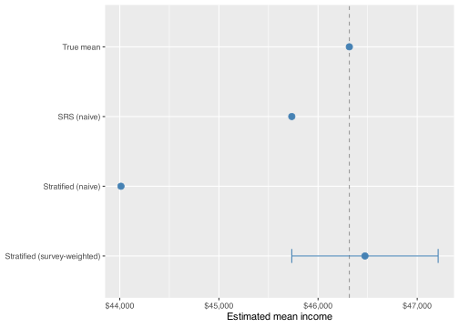

- [Simulating a known population](#simulating-a-known-population)
- [Simple random sampling](#simple-random-sampling)
- [Stratified sampling](#stratified-sampling)
- [When the design matters](#when-the-design-matters)

``` r
library(tidyverse)
library(srvyr)

set.seed(42)
```

When a survey samples a small fraction of a large population, the way respondents were selected determines how you should estimate population quantities. Getting the design right matters — not always for the point estimate, but for the standard error, and crucially when sampling probabilities differ across groups.

The **`srvyr`** package (a tidyverse wrapper around Thomas Lumley’s `survey`) lets you describe the sampling design to R. Once described, `survey_mean()` and related functions compute estimates and standard errors that are valid for the full target population.

## Simulating a known population

We build a synthetic country of 10,000 people. The country is 70% urban and 30% rural, with a meaningful income gap between the two groups.

``` r
N <- 10000
n_urban <- round(N * 0.70)
n_rural <- round(N * 0.30)

population <- bind_rows(
  tibble(
    id = 1:n_urban,
    group = "urban",
    income = rnorm(n_urban, mean = 50000, sd = 8000)
  ),
  tibble(
    id = (n_urban + 1):N,
    group = "rural",
    income = rnorm(n_rural, mean = 38000, sd = 7000)
  )
)

pop_mean <- mean(population$income)
```

The true population mean income is **\$46,315**. This is what we’re trying to recover from a sample.

## Simple random sampling

With simple random sampling (SRS), every person has the same probability of being selected. We draw 500 people at random.

``` r
n <- 500
srs_sample <- population |> slice_sample(n = n)
```

The naive estimate is just `mean()`:

``` r
naive_srs <- mean(srs_sample$income)
```

To use `srvyr`, we describe the design with `as_survey_design()` — `ids = 1` means no clustering — and then call `survey_mean()`:

``` r
srs_design <- srs_sample |>
  as_survey_design(ids = 1)

srs_estimate <- srs_design |>
  summarise(income = survey_mean(income, vartype = "ci"))
```

For SRS, both approaches return nearly the same estimate — the naive mean and the survey mean agree, and their standard errors are equivalent. This is expected: SRS gives every unit an equal selection probability, so no reweighting is needed. The value of going through `srvyr` here is to establish a workflow that remains correct when the design becomes more complex.

## Stratified sampling

Country-level surveys rarely use pure SRS. A common alternative is **stratified sampling**: the population is divided into strata, and a separate sample is drawn from each. This is often used to ensure adequate representation of smaller subgroups.

Suppose we sample 250 urban and 250 rural respondents — equal numbers despite the 70/30 population split. Rural respondents are overrepresented relative to their share of the population.

``` r
n_per_stratum <- 250

stratified_sample <- bind_rows(
  population |> filter(group == "urban") |> slice_sample(n = n_per_stratum),
  population |> filter(group == "rural") |> slice_sample(n = n_per_stratum)
) |>
  mutate(
    weight = case_when(
      group == "urban" ~ n_urban / n_per_stratum,
      group == "rural" ~ n_rural / n_per_stratum
    )
  )
```

Each weight is the inverse of the selection probability: an urban respondent was drawn from 7,000 with probability 250/7000, so they represent 28 people in the population. A rural respondent represents 12.

The naive estimate ignores the oversampling and treats all 500 respondents equally:

``` r
naive_stratified <- mean(stratified_sample$income)
```

The naive mean is **\$44,012** — about \$2,303 below the true mean. Rural respondents have lower incomes and are overrepresented, so the unweighted average is pulled downward.

The survey-aware estimate corrects for this:

``` r
stratified_design <- stratified_sample |>
  as_survey_design(
    strata = group,
    ids = 1,
    weights = weight
  )

stratified_estimate <- stratified_design |>
  summarise(income = survey_mean(income, vartype = "ci"))
```

The weighted mean is **\$46,473** — back in line with the true population mean. Weighting each observation by how many people it represents undoes the distortion from unequal sampling.

    Warning: `geom_errorbarh()` was deprecated in ggplot2 4.0.0.
    ℹ Please use the `orientation` argument of `geom_errorbar()` instead.

    `height` was translated to `width`.



## When the design matters

For SRS, naive and survey estimates agree — but real surveys almost never use pure SRS. Stratification, oversampling of minority groups, and cluster sampling (selecting households or geographic areas rather than individuals) are all common. Each of these gives different units different selection probabilities, which naive `mean()` doesn’t account for.

The workflow above extends to all of these cases: describe the design once in `as_survey_design()`, then use `survey_mean()`, `survey_total()`, or `survey_ratio()` for estimation. Adding the correct weights is often the only thing standing between a biased estimate and an accurate one.
