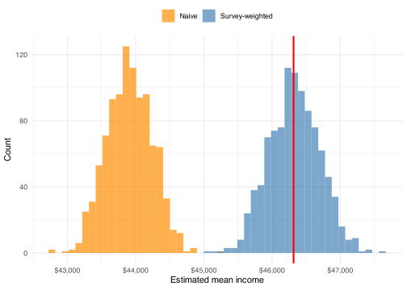
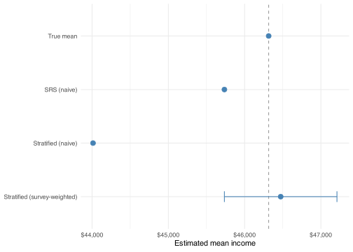

- [Designs and weights](#designs-and-weights)
- [Simulating a known population](#simulating-a-known-population)
- [Simple random sampling](#simple-random-sampling)
- [Stratified sampling](#stratified-sampling)
- [When the design matters](#when-the-design-matters)
- [Can you use `lm()` instead?](#can-you-use-lm-instead)

``` r
library(tidyverse)
library(srvyr)

set.seed(42)
```

> [!NOTE]
>
> This page is a work in progress.

When a survey samples a small fraction of a large population, the way respondents were selected determines how you should estimate population quantities. The **sampling design** encodes the rules that determined who ended up in your sample: whether everyone had an equal chance of selection, whether the population was divided into subgroups (strata) before sampling, and whether individuals or clusters (such as households) were the primary sampling unit.

## Designs and weights

The core idea behind design-based estimation is the **sampling weight**: each respondent in the sample is assigned a weight equal to the inverse of their selection probability. If a person had a 1-in-50 chance of being selected, their weight is 50, meaning they represent 50 people in the population.

When every person has the same selection probability (simple random sampling), all weights are equal and the weighted mean reduces to the ordinary mean. When selection probabilities differ, the weights correct for the imbalance by up-weighting underrepresented respondents and down-weighting overrepresented ones.

The **`srvyr`** package (a tidyverse wrapper around Thomas Lumley’s `survey`) handles this. You describe the sampling design to R using `as_survey_design()`, then call `survey_mean()` and related functions. These use the weights internally to compute estimates and standard errors that are valid for the full target population.

## Simulating a known population

Working with a simulated population lets us check our estimates against the truth. Since we build the population ourselves, we know the exact mean, so we can verify that our survey estimates recover it correctly.

We simulate a country of 10,000 people. The country is 70% urban and 30% rural, with a meaningful income gap between the two groups.

``` r
N <- 10000
n_urban <- round(N * 0.70)
n_rural <- round(N * 0.30)

population <- bind_rows(
  tibble(
    id = 1:n_urban,
    group = "urban",
    income = rnorm(n_urban, mean = 50000, sd = 8000)
  ),
  tibble(
    id = (n_urban + 1):N,
    group = "rural",
    income = rnorm(n_rural, mean = 38000, sd = 7000)
  )
)

pop_mean <- mean(population$income)
```

The true population mean income is \$46,315. This is what we’re trying to recover from a sample.

## Simple random sampling

With simple random sampling (SRS), every person has the same probability of being selected. We draw 500 people at random.

``` r
n <- 500
srs_sample <- population |> slice_sample(n = n)
```

The naive estimate is just `mean()`:

``` r
naive_srs <- mean(srs_sample$income)
```

To use `srvyr`, we describe the design with `as_survey_design()` and then call `survey_mean()`. The `ids` argument specifies the primary sampling unit. Setting it to `1` tells R that each row is its own unit, with no clustering (no households or geographic areas containing multiple respondents).

``` r
srs_design <- srs_sample |>
  as_survey_design(ids = 1)

srs_estimate <- srs_design |>
  summarise(income = survey_mean(income, vartype = "ci"))
```

For SRS, both approaches return nearly the same estimate. The naive mean and the survey mean agree, and their standard errors are equivalent. This is expected: SRS gives every unit an equal selection probability, so all weights are equal and the weighted mean reduces to the ordinary mean. The value of going through `srvyr` here is simply to establish a workflow that applies correctly to more complex designs.

## Stratified sampling

Country-level surveys rarely use pure SRS. A common alternative is **stratified sampling**: the population is divided into strata, and a separate sample is drawn from each. This is often used to ensure adequate representation of smaller subgroups.

Suppose we sample 250 urban and 250 rural respondents despite the 70/30 population split. Rural respondents are overrepresented relative to their actual share of the population.

``` r
n_per_stratum <- 250

stratified_sample <- bind_rows(
  population |> filter(group == "urban") |> slice_sample(n = n_per_stratum),
  population |> filter(group == "rural") |> slice_sample(n = n_per_stratum)
) |>
  mutate(
    weight = case_when(
      group == "urban" ~ n_urban / n_per_stratum,
      group == "rural" ~ n_rural / n_per_stratum
    )
  )
```

The weights are the inverse selection probabilities. An urban respondent was selected with probability 250/7000 (250 drawn from 7,000), so their weight is 28. A rural respondent was selected with probability 250/3000, giving a weight of 12.

Conceptually, the weight is how many people in the population each respondent speaks for. Urban respondents each represent 28 people; rural respondents each represent 12. The weighted average then reflects the true composition of the population rather than the composition of the sample. This is exactly the computation `survey_mean()` performs internally.

The naive estimate ignores the oversampling and treats all 500 respondents equally:

``` r
naive_stratified <- mean(stratified_sample$income)
```

The naive mean is **\$44,012**, about \$2,303 below the true mean. Rural respondents have lower incomes and are overrepresented, so the unweighted average is pulled downward.

The survey-aware estimate corrects for this:

``` r
stratified_design <- stratified_sample |>
  as_survey_design(
    strata = group,
    ids = 1,
    weights = weight
  )

stratified_estimate <- stratified_design |>
  summarise(income = survey_mean(income, vartype = "ci"))
```

The weighted mean is **\$46,473**, close to the true population mean. Weighting each observation by how many people it represents undoes the distortion from unequal sampling. That said, any single sample varies due to chance, so the estimate won’t match the true mean exactly. What matters is whether the estimator is *unbiased*: does it centre on the true value across many samples?

To check this, we repeat the stratified sampling procedure 1,000 times and compute both the naive and weighted mean for each draw. Inside each replicate we use `weighted.mean()` directly rather than the full `srvyr` machinery, which gives the same point estimate more efficiently.

``` r
sims <- 1000

estimates <- replicate(sims, {
  samp <- bind_rows(
    population |> filter(group == "urban") |> slice_sample(n = n_per_stratum),
    population |> filter(group == "rural") |> slice_sample(n = n_per_stratum)
  ) |>
    mutate(weight = case_when(
      group == "urban" ~ n_urban / n_per_stratum,
      group == "rural" ~ n_rural / n_per_stratum
    ))

  c(
    naive    = mean(samp$income),
    weighted = weighted.mean(samp$income, samp$weight)
  )
}, simplify = FALSE) |>
  bind_rows()
```



The naive estimates are shifted left: they consistently underestimate the true mean because rural respondents (lower income, oversampled) are given too much weight. The survey-weighted estimates are centred on the true mean. Both distributions have the same width — the sampling variance is the same — but only one is in the right place.

    Warning: `geom_errorbarh()` was deprecated in ggplot2 4.0.0.
    ℹ Please use the `orientation` argument of `geom_errorbar()` instead.

    `height` was translated to `width`.



## When the design matters

For SRS, naive and survey estimates agree. But real surveys almost never use pure SRS. Stratification, oversampling of minority groups, and cluster sampling (selecting households or geographic areas rather than individuals) are all common. Each of these gives different units different selection probabilities, which naive `mean()` doesn’t account for.

The workflow above extends to all of these cases: describe the design once in `as_survey_design()`, then use `survey_mean()`, `survey_total()`, or `survey_ratio()` for estimation. Adding the correct weights is often the only thing standing between a biased estimate and an accurate one.

## Can you use `lm()` instead?

`lm()` has a `weights` argument, so it’s natural to wonder whether you can skip `srvyr` entirely and just pass your sampling weights there.

For the point estimate, yes. `lm(income ~ 1, data = samp, weights = weight)` returns the same weighted mean as `survey_mean()`, and `lm(y ~ x, weights = weight)` gives the same weighted regression coefficients as `svyglm()`. The weights shift the fit in exactly the way you’d want.

The problem is the standard errors. `lm()` treats the weights as *precision weights*: it assumes that observation $i$ has residual variance proportional to $1/w_i$, which is a model assumption about heteroskedasticity. The standard errors it reports are based on that assumption, not on how the sample was drawn.

`srvyr` and the `survey` package instead compute **design-based standard errors** using Taylor linearization. For a stratified design, the variance of the weighted mean is estimated from the within-stratum spread of the outcome:

$$\widehat{\text{Var}}(\bar{y}_w) = \sum_h \left(\frac{N_h}{N}\right)^2 \frac{s_h^2}{n_h}$$

This uses only the sampling structure — stratum sizes and sample counts — and makes no assumption about the distribution of the outcome. The result is valid regardless of whether any regression model is correctly specified.

We can see the difference directly. Here we compare the standard error from `lm()` to the one from `survey_mean()` on the same stratified sample:

``` r
lm_se     <- summary(lm(income ~ 1, data = stratified_sample, weights = weight))$coefficients[, "Std. Error"]
survey_se <- stratified_estimate |> mutate(se = (income_upp - income_low) / (2 * 1.96)) |> pull(se)

cat("lm() SE:     ", round(lm_se), "\n")
```

    lm() SE:      422 

``` r
cat("survey SE:   ", round(survey_se), "\n")
```

    survey SE:    377 

The two SEs differ because they are answering slightly different questions. The `lm()` SE asks: given a WLS model with these variance assumptions, how uncertain is the intercept? The survey SE asks: given that this sample was drawn using stratified random sampling, how uncertain is the population mean? For survey inference you want the latter.

For regression with covariates and survey data, use `svyglm()` from the `survey` package directly:

``` r
svyglm(income ~ some_predictor, design = stratified_design)
```

It gives the same coefficients as `lm(..., weights = weight)` with design-based SEs. The gap between the two matters most when the design includes clustering, where `lm()` SEs can be substantially too small.
