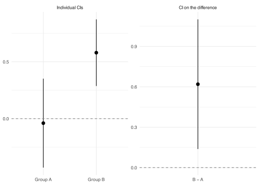
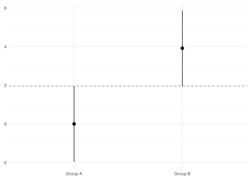
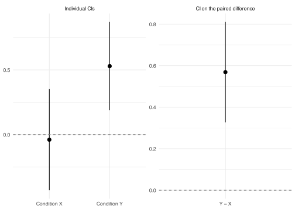

- [When CIs overlap](#when-cis-overlap)
- [When CIs don’t overlap](#when-cis-dont-overlap)
- [The correct check](#the-correct-check)
- [A note on proportions](#a-note-on-proportions)
- [A note on within-subject designs](#a-note-on-within-subject-designs)

``` r
library(tidyverse)

theme_set(theme_minimal())
```

A pair of 95% confidence intervals that don’t overlap visually looks like evidence of a statistically significant difference between two groups. A pair that overlaps looks like evidence that there isn’t one.

Both readings are unreliable, but not equally so. Overlapping CIs can still hide a significant difference, which makes that case the more consequential one to get wrong.

## When CIs overlap

Overlapping individual CIs do not imply a non-significant difference. Two CIs can overlap noticeably and the test on the difference can still return p \< .05.

The overlap heuristic and the significance test both ask whether the gap between the two group means is large enough, but they use different yardsticks for “large enough.” Overlap only fails once the gap exceeds the sum of the two individual margins of error, as if the errors in the two group means always worked against each other in the worst possible way. The significance test instead works with the standard error of the difference between the means. Because the two group means are estimated independently, their errors don’t stack like that; the standard error of the difference is smaller than the sum of the two individual standard errors. That gap between the two yardsticks leaves room for a difference that is large enough to be significant but not large enough to separate the two CIs.

For equal group sizes, the math makes this precise. Each individual 95% CI has a half-width of 1.96 × SE. The two CIs don’t overlap when the difference between the group means exceeds 1.96 × SE + 1.96 × SE = 3.92 × SE. Significance at p \< .05, however, only requires the difference to exceed 1.96 × √(SE² + SE²) = 1.96 × √2 × SE ≈ 2.77 × SE. Any difference between 2.77 × SE and 3.92 × SE is significant at p \< .05 but won’t be caught by the overlap heuristic.

Two groups simulated with a true mean difference of 0.5 illustrate this gap. Their individual 95% CIs overlap, but the test on the difference returns p \< .05.

``` r
set.seed(42)
n <- 40

group_a <- rnorm(n, mean = 0, sd = 1)
group_b <- rnorm(n, mean = 0.5, sd = 1)

ci_a <- t.test(group_a)$conf.int
ci_b <- t.test(group_b)$conf.int

tibble(
  Group = c("A", "B"),
  Lower = round(c(ci_a[1], ci_b[1]), 2),
  Upper = round(c(ci_a[2], ci_b[2]), 2)
)
```

| Group | Lower | Upper |
|:------|------:|------:|
| A     | -0.43 |  0.35 |
| B     |  0.29 |  0.87 |

The upper bound of Group A’s CI extends past the lower bound of Group B’s. Testing the difference directly gives a different picture.

``` r
diff_test <- t.test(group_b, group_a)
diff_test
```


        Welch Two Sample t-test

    data:  group_b and group_a
    t = 2.5645, df = 72.3, p-value = 0.01241
    alternative hypothesis: true difference in means is not equal to 0
    95 percent confidence interval:
     0.1379476 1.1008142
    sample estimates:
      mean of x   mean of y 
     0.57984500 -0.03953589 

The CI on the difference excludes zero and the p-value is below .05. The figure below shows both intervals side by side: the individual CIs overlap on the left, while the CI on the difference clears zero on the right.



## When CIs don’t overlap

When two 95% CIs have no overlap at all, the difference is statistically significant, but at approximately p \< .01, not p \< .05. Non-overlap is reliable as a signal, just stricter than the standard significance threshold.

The boundary case shows how strict. When the two CIs are just barely non-overlapping, with the upper bound of one equal to the lower bound of the other, the gap between the estimates is exactly 3.92 × SE, the same threshold derived above for equal group sizes. The figure below sets SE = 1 to show that boundary directly.



At this exact boundary, the p-value is 0.006: even the least clear-cut non-overlap case is far more significant than the standard .05 threshold requires.

A simulated example shows the same pattern with real, noisy data, well past the boundary. With a true mean difference of 1.0, the individual CIs no longer overlap, and the p-value from the t-test is well below .01.

``` r
set.seed(42)

group_c <- rnorm(n, mean = 0, sd = 1)
group_d <- rnorm(n, mean = 1, sd = 1)

ci_c <- t.test(group_c)$conf.int
ci_d <- t.test(group_d)$conf.int

tibble(
  Group = c("C", "D"),
  Lower = round(c(ci_c[1], ci_d[1]), 2),
  Upper = round(c(ci_c[2], ci_d[2]), 2)
)
```

| Group | Lower | Upper |
|:------|------:|------:|
| C     | -0.43 |  0.35 |
| D     |  0.79 |  1.37 |

``` r
t.test(group_d, group_c)
```


        Welch Two Sample t-test

    data:  group_d and group_c
    t = 4.6347, df = 72.3, p-value = 1.545e-05
    alternative hypothesis: true difference in means is not equal to 0
    95 percent confidence interval:
     0.6379476 1.6008142
    sample estimates:
      mean of x   mean of y 
     1.07984500 -0.03953589 

## The correct check

The right approach is to compute the CI on the difference directly. If that CI excludes zero, the result is significant at the corresponding level. In R, `t.test(group_b, group_a)` returns both the p-value and the CI on the difference in one call.

## A note on proportions

The same logic applies to proportions: overlapping individual CIs don’t imply a non-significant difference. There’s an additional complication, though. Standard CIs for proportions (such as Wilson or Clopper-Pearson intervals) are asymmetric when proportions are near 0 or 1, extending further on one side of the estimate than the other. This makes visual overlap harder to reason about precisely.

Standard tests for two proportions also use a pooled estimate of the proportion under the null hypothesis to compute the standard error, rather than the individual standard errors. The test statistic doesn’t decompose cleanly from the individual CIs. The practical advice is the same (examine the CI on the difference, not the individual CIs), but the individual-CI heuristic is even less reliable for proportions than for means.

## A note on within-subject designs

The derivation above assumes the two groups are independent, which holds for between-subjects designs but not for within-subject ones. In a within-subject design, the same participants provide both measurements, so the two condition means are correlated rather than independent.

That correlation changes the standard error of the difference. For independent groups, it’s √(SE₁² + SE₂²). For paired data, the formula needs a correction for the correlation r between the two conditions: √(SE₁² + SE₂² − 2r × SE₁ × SE₂). Positive correlation, typical of repeated-measures data, shrinks the standard error of the difference below what the independent-groups formula would give.

The overlap heuristic doesn’t know about r. Each individual CI still has a half-width of 1.96 × SE, so the two CIs still need a gap of 3.92 × SE before they stop overlapping, exactly as in the independent case. But the actual significance threshold keeps shrinking as r grows, below the 2.77 × SE threshold already derived for independent groups. The stronger the within-subject correlation, the wider the gap between what overlap requires and what significance requires.

A simulated example shows the size of that gap. Conditions X and Y have a true mean difference of 0.5, the same difference used in the independent-groups example earlier, but each participant’s two scores share a correlation of .7.

``` r
set.seed(42)
r <- 0.7

shared <- rnorm(n)
noise <- rnorm(n)

condition_x <- shared
condition_y <- r * shared + sqrt(1 - r^2) * noise + 0.5

ci_x <- t.test(condition_x)$conf.int
ci_y <- t.test(condition_y)$conf.int

tibble(
  Condition = c("X", "Y"),
  Lower = round(c(ci_x[1], ci_y[1]), 2),
  Upper = round(c(ci_x[2], ci_y[2]), 2)
)
```

| Condition | Lower | Upper |
|:----------|------:|------:|
| X         | -0.43 |  0.35 |
| Y         |  0.19 |  0.87 |

The two individual CIs overlap, much as they did in the independent-groups example. Testing the paired difference directly tells a different story.

``` r
paired_test <- t.test(condition_y, condition_x, paired = TRUE)
paired_test
```


        Paired t-test

    data:  condition_y and condition_x
    t = 4.762, df = 39, p-value = 2.646e-05
    alternative hypothesis: true mean difference is not equal to 0
    95 percent confidence interval:
     0.3272446 0.8105184
    sample estimates:
    mean difference 
          0.5688815 

Run as an independent-samples test, ignoring that the same participants generated both conditions, the same data give p = 0.03, barely under the standard threshold. Run correctly as a paired test, as above, the p-value is smaller by several orders of magnitude. The positive correlation between conditions removes variability that the independent-samples formula would otherwise count against the difference.

The figure below shows both views side by side: the individual CIs overlap on the left, while the CI on the paired difference clears zero by a wide margin on the right.



The correct check is the same as before: compute the CI on the difference directly, not the two individual CIs. For paired data in R, that means passing `paired = TRUE` to `t.test()`.

There’s a second, related problem when plotting within-subject means. The standard CI for each condition reflects between-subject variability, differences in overall response level from one participant to the next, and that variability is irrelevant to a within-subject comparison. Two participants who respond 3 and 7 on average across both conditions widen the error bars even if their within-subject difference between conditions is identical.

The Cousineau-Morey correction removes that irrelevant variability before computing each condition’s error bars. It centers every participant’s scores on their own mean, then rescales the result to correct for the resulting underestimate of variance. The corrected error bars are narrower and reflect the within-subject variability the comparison actually depends on, rather than between-subject differences that have nothing to do with it.

Even with that correction applied, the same rule from this page holds. Two corrected CIs can still overlap while the paired difference is significant, and non-overlap still implies a stricter threshold than p \< .05. The Cousineau-Morey correction makes the plotted error bars honest about within-subject variability; it doesn’t change why the overlap heuristic fails.
